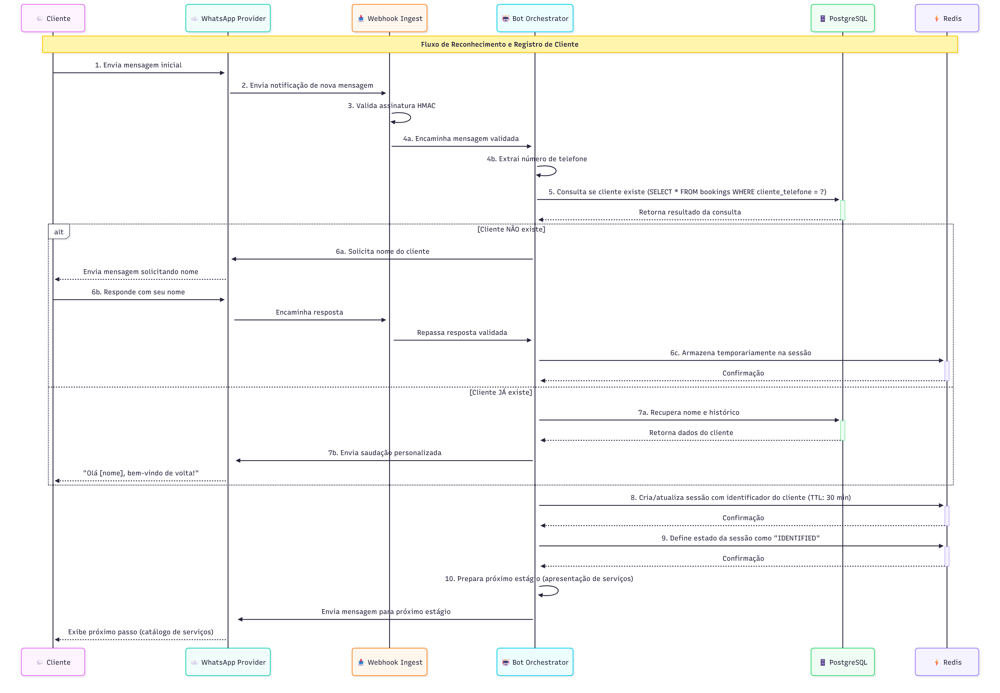
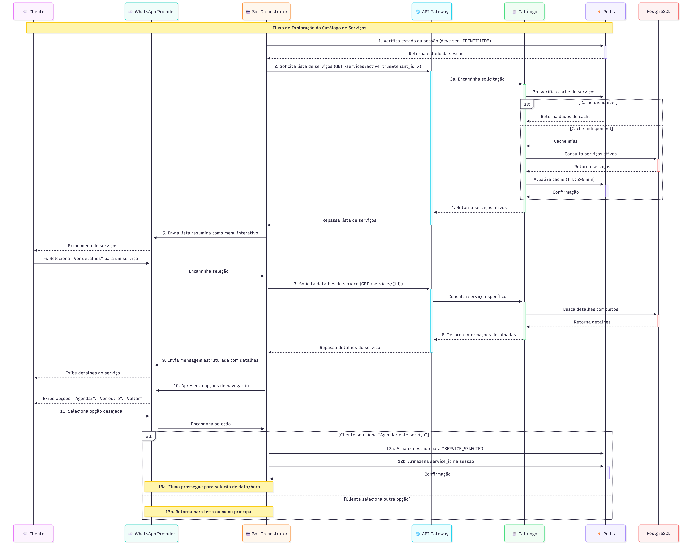
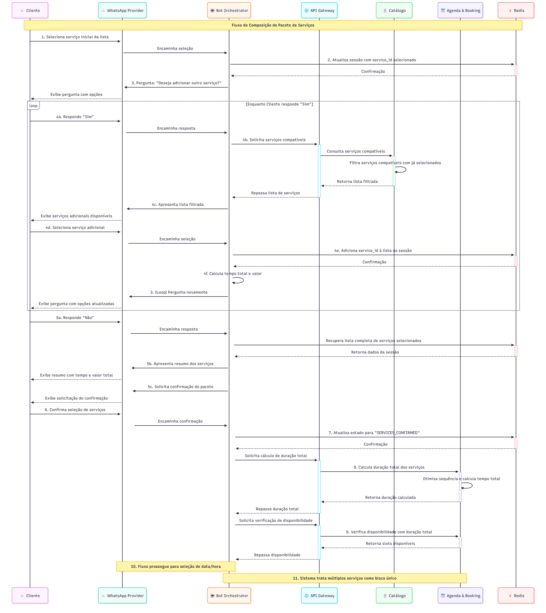
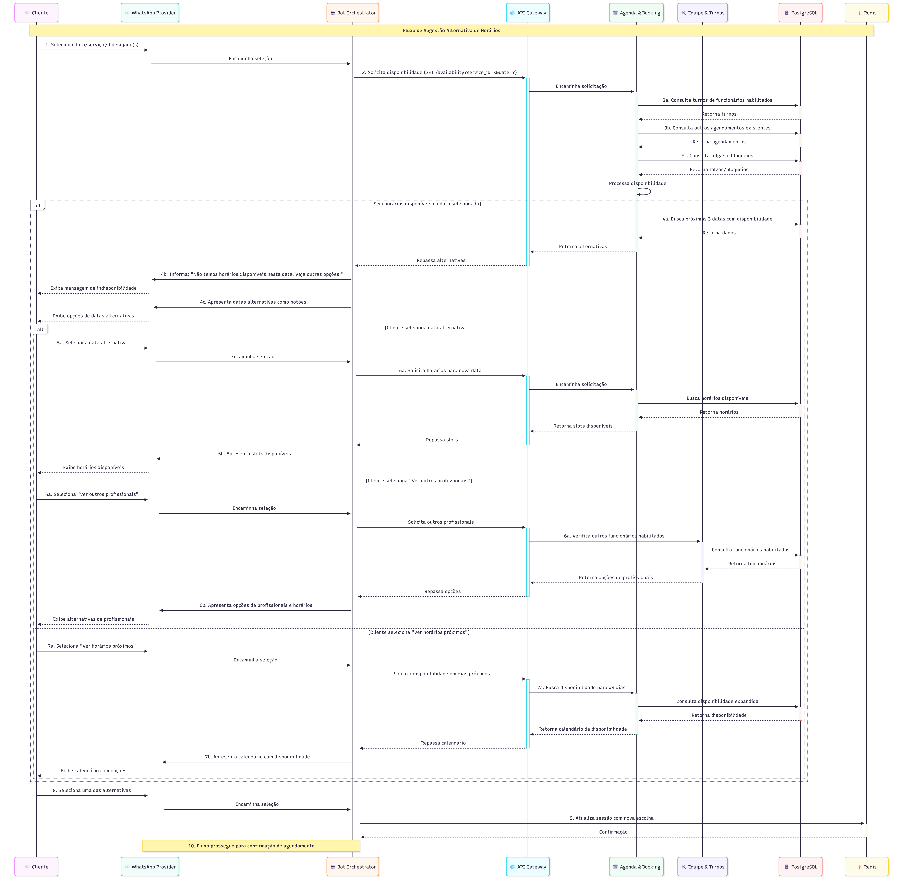
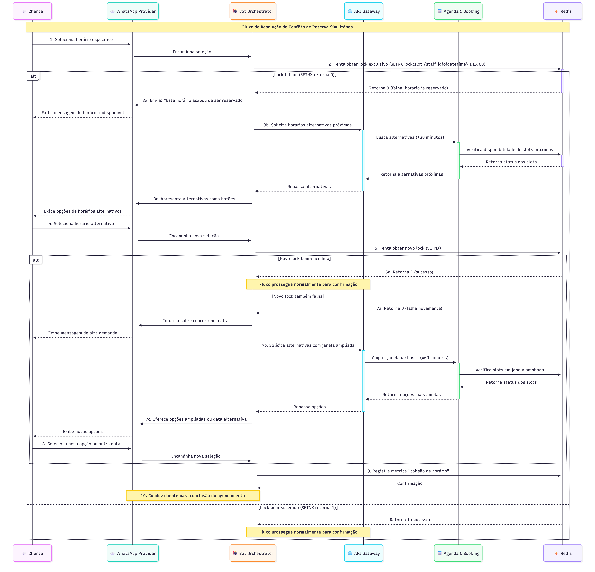
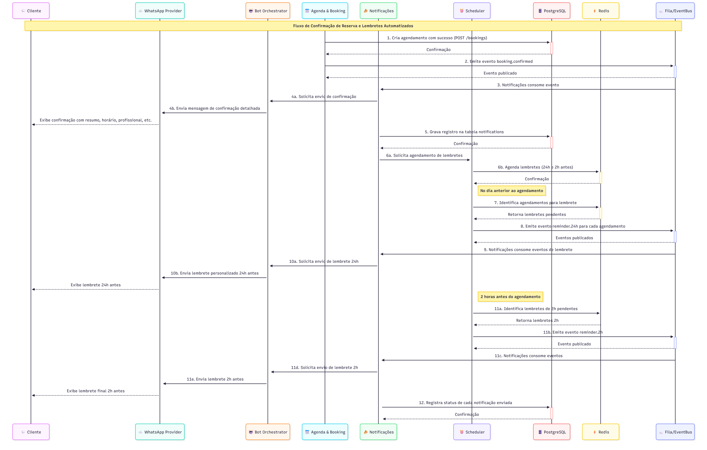
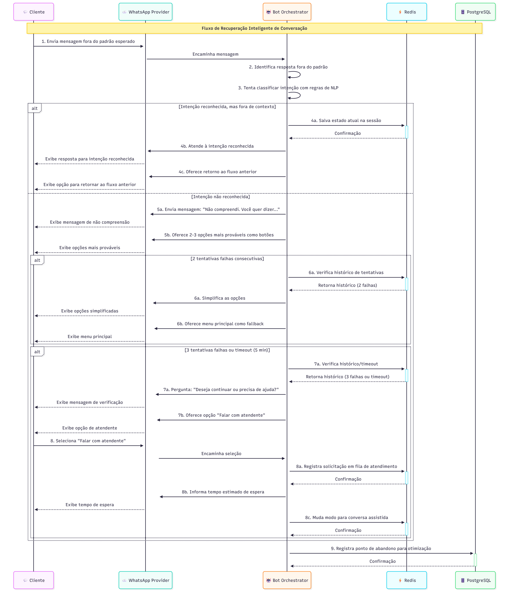
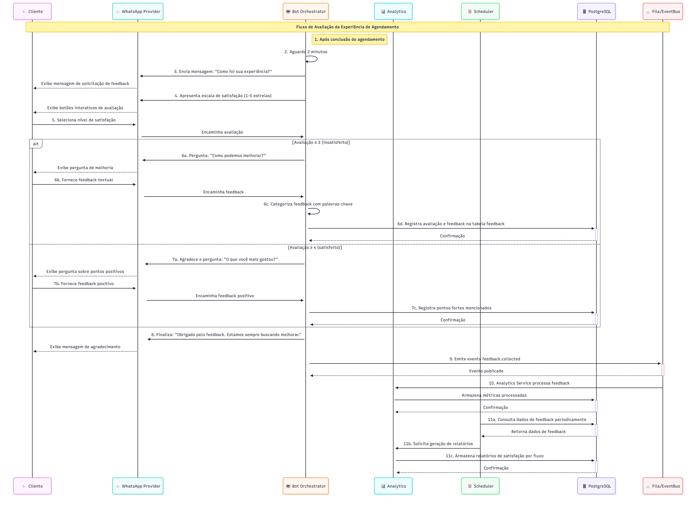

# Fluxos do Cliente

Estes fluxos descrevem a jornada do cliente através do bot de WhatsApp, desde o primeiro contato até o feedback pós-atendimento.

---

## 📑 Índice de Fluxos

### Fluxos Essenciais (MVP)
1. [Identificação/Cadastro de Cliente](#fluxo-1-identificaçãocadastro-de-cliente) - Reconhecimento e Registro
2. [Visualização de Informações de Serviço](#fluxo-2-visualização-de-informações-de-serviço) - Exploração do Catálogo
3. [Agendamento de Múltiplos Serviços](#fluxo-3-agendamento-de-múltiplos-serviços) - Composição de Pacotes
4. [Reagendamento em Caso de Indisponibilidade](#fluxo-4-reagendamento-em-caso-de-indisponibilidade) - Sugestão Alternativa
5. [Falha na Obtenção do Lock (conflito de horário)](#fluxo-5-falha-na-obtenção-do-lock-conflito-de-horário) - Resolução de Conflito
6. [Confirmação e Lembrete](#fluxo-6-confirmação-e-lembrete) - Confirmação e Lembretes

### Fluxos Opcionais
7. [Integração com Pagamento (Futuro)](#fluxo-7-integração-com-pagamento-futuro) - Processamento de Pagamento
8. [Tratamento de Erros e Recuperação de Conversa](#fluxo-8-tratamento-de-erros-e-recuperação-de-conversa) - Recuperação Inteligente
9. [Feedback Pós-Atendimento](#fluxo-9-feedback-pós-atendimento) - Avaliação do Serviço
10. [Consulta e Reutilização de Agendamentos Passados](#fluxo-10-consulta-e-reutilização-de-agendamentos-passados) - Histórico e Reagendamento

---

## Fluxos Essenciais (MVP)

### Fluxo 1 - Identificação/Cadastro de Cliente

> Persona: Cliente
> Canal: WhatsApp
> Frequência: Cada novo cliente ou cliente recorrente
> Objetivo: Reconhecimento e registro do cliente

#### Título: Reconhecimento e Registro de Cliente

#### História de Usuário
Como cliente, quero ser identificado pelo sistema quando inicio uma conversa no WhatsApp, para que não precise fornecer minhas informações repetidamente a cada novo agendamento.

#### Fluxo de uso (Diagrama de Sequência)
1. 💬 Cliente envia mensagem inicial para o número do WhatsApp do estabelecimento
2. ☁️ WhatsApp Provider envia notificação para 📥 Webhook Ingest
3. 📥 Webhook Ingest valida assinatura HMAC da mensagem para garantir autenticidade
4. 🤖 Bot Orchestrator extrai número de telefone da mensagem recebida
5. 🤖 Bot Orchestrator consulta 🗄️ PostgreSQL para verificar se o cliente já existe (SELECT * FROM bookings WHERE cliente_telefone = ?)
6. Se cliente NÃO existir no sistema:
   a. 🤖 Bot Orchestrator solicita nome do cliente
   b. 💬 Cliente responde com seu nome
   c. 🤖 Bot Orchestrator armazena temporariamente na sessão do ⚡ Redis
7. Se cliente JÁ existir:
   a. 🤖 Bot Orchestrator recupera nome e histórico básico
   b. 🤖 Bot Orchestrator personaliza saudação ("Olá [nome], bem-vindo de volta!")
8. 🤖 Bot Orchestrator cria ou atualiza sessão no ⚡ Redis com identificador do cliente
9. 🤖 Bot Orchestrator define estado da sessão como "IDENTIFIED"
10. 🤖 Bot Orchestrator prossegue para o próximo estágio do fluxo (apresentação de serviços)

#### Critérios de Aceitação
- Deve identificar corretamente clientes recorrentes pelo número de telefone
- Deve solicitar e capturar nome apenas para novos clientes
- Deve garantir persistência dos dados do cliente de forma segura e em conformidade com LGPD
- Deve estabelecer sessão ativa no Redis com TTL de 30 minutos
- Deve tratar números de telefone em diferentes formatos (+55, com/sem DDD)

#### Definition of Done
- Implementação do reconhecimento de clientes por número de telefone
- Estratégia de persistência de dados pessoais implementada com criptografia
- Testes de verificação de identidade para novos e antigos clientes
- Validação de formato de números de telefone internacionais
- Documentação dos formatos de sessão Redis para clientes
- Implementação de logging para auditoria de identificações

---

### Fluxo 2 - Visualização de Informações de Serviço

> Persona: Cliente
> Canal: WhatsApp
> Frequência: Cada agendamento
> Objetivo: Exploração do catálogo de serviços

#### Título: Exploração do Catálogo de Serviços

#### História de Usuário
Como cliente, quero visualizar detalhes dos serviços disponíveis, para que eu possa entender o que cada serviço inclui, quanto tempo dura e quanto custa antes de fazer minha escolha.

#### Fluxo de uso (Diagrama de Sequência)
1. 🤖 Bot Orchestrator verifica estado da sessão no ⚡ Redis (deve ser "IDENTIFIED")
2. 🤖 Bot Orchestrator solicita ao 🌐 API Gateway a lista de serviços disponíveis (GET /services?active=true&tenant_id=X)
3. 🌐 API Gateway consulta 🧾 Catálogo (com cache ⚡ Redis prioritário)
4. 🧾 Catálogo retorna serviços ativos para o tenant
5. 🤖 Bot Orchestrator formata e apresenta lista resumida de serviços como menu interativo
6. 💬 Cliente seleciona opção "Ver detalhes" para um serviço específico
7. 🤖 Bot Orchestrator solicita detalhes específicos do serviço ao 🌐 API Gateway via ``GET /services/{id}``
8. 🌐 API Gateway retorna informações detalhadas (descrição completa, preço, duração, imagem se disponível)
9. 🤖 Bot Orchestrator formata e envia detalhes do serviço em mensagem estruturada via ☁️ WhatsApp Provider
10. 🤖 Bot Orchestrator apresenta opções: "Agendar este serviço", "Ver outro serviço", "Voltar ao menu principal"
11. 💬 Cliente seleciona opção desejada
12. Se "Agendar este serviço", 🤖 Bot Orchestrator atualiza estado da sessão no ⚡ Redis para "SERVICE_SELECTED" e armazena service_id
13. Fluxo prossegue para seleção de data/hora ou retorna para lista de serviços

#### Critérios de Aceitação
- Deve exibir lista categorizada de serviços ativos com informações essenciais (nome e preço)
- Deve permitir visualização detalhada de cada serviço individualmente
- Deve garantir que informações exibidas (preço, duração) estejam atualizadas com cache curto
- Deve formatação adequada para leitura em dispositivos móveis (mensagens concisas, uso de emojis)
- Deve oferecer navegação intuitiva entre lista de serviços e detalhes

#### Definition of Done
- Implementação de templates de mensagens para lista de serviços e detalhes
- Integração com recursos nativos do WhatsApp (botões, listas, cards)
- Caching configurado para informações de catálogo (TTL 2-5 minutos)
- Testes de usabilidade em diferentes dispositivos e tamanhos de tela
- Log de análise de quais serviços são mais visualizados
- Mecanismos de feedback implementados para melhorar descrições

---

### Fluxo 3 - Agendamento de Múltiplos Serviços

> Persona: Cliente
> Canal: WhatsApp
> Frequência: Cada agendamento
> Objetivo: Composição de pacotes de serviços

#### Título: Composição de Pacotes de Serviços

#### História de Usuário
Como cliente, quero agendar vários serviços para a mesma visita, para que eu possa otimizar meu tempo e realizar múltiplos procedimentos em sequência.

#### Fluxo de uso (Diagrama de Sequência)
1. 💬 Cliente seleciona um serviço inicial da lista
2. 🤖 Bot Orchestrator atualiza sessão no ⚡ Redis com service_id selecionado
3. 🤖 Bot Orchestrator pergunta: "Deseja adicionar outro serviço a este agendamento?"
4. Se 💬 Cliente responde "Sim":
   a. 🤖 Bot Orchestrator recupera serviços compatíveis do 🧾 Catálogo (considerando serviços já selecionados)
   b. 🤖 Bot Orchestrator apresenta lista filtrada de serviços adicionais
   c. 💬 Cliente seleciona serviço adicional
   d. 🤖 Bot Orchestrator adiciona service_id à lista na sessão do ⚡ Redis
   e. 🤖 Bot Orchestrator atualiza tempo total e valor estimado do pacote
   f. 🤖 Bot Orchestrator retorna ao passo 3 (pergunta se deseja adicionar mais)
5. Se 💬 Cliente responde "Não":
   a. 🤖 Bot Orchestrator apresenta resumo dos serviços selecionados
   b. 🤖 Bot Orchestrator exibe tempo total e valor total
   c. 🤖 Bot Orchestrator solicita confirmação do pacote
6. 💬 Cliente confirma seleção de serviços
7. 🤖 Bot Orchestrator atualiza estado da sessão no ⚡ Redis para "SERVICES_CONFIRMED"
8. 📅 Agenda & Booking calcula duração total dos serviços selecionados
9. 📅 Agenda & Booking verifica disponibilidade considerando a duração total
10. Fluxo prossegue para seleção de data/hora com duração ajustada
11. Nos passos subsequentes, o sistema tratará os múltiplos serviços como um único bloco de tempo

#### Critérios de Aceitação
- Deve permitir seleção de até 5 serviços em um único agendamento
- Deve calcular corretamente o tempo total necessário para todos os serviços selecionados
- Deve garantir que apenas combinações compatíveis de serviços sejam oferecidas
- Deve exibir claramente o resumo do pacote com todos os serviços, tempo total e valor total
- Deve verificar disponibilidade de funcionários habilitados para todos os serviços selecionados

#### Definition of Done
- Implementação de lógica de seleção múltipla na sessão do bot
- Algoritmo de cálculo de duração total com otimização de sequência
- Regras de compatibilidade de serviços implementadas
- Interface para apresentação de resumo de pacote
- Testes de validação para diferentes combinações de serviços
- Persistência de agendamentos com múltiplos serviços na base de dados

---

### Fluxo 4 - Reagendamento em Caso de Indisponibilidade

> Persona: Cliente
> Canal: WhatsApp
> Frequência: Cada agendamento
> Objetivo: Sugestão de horários alternativos

#### Título: Sugestão Alternativa de Horários

#### História de Usuário
Como cliente, quero receber sugestões de horários alternativos quando minha preferência inicial não está disponível, para que eu possa encontrar um horário adequado sem reiniciar todo o processo de agendamento.

#### Fluxo de uso (Diagrama de Sequência)
1. 💬 Cliente seleciona data/serviço(s) desejado(s)
2. 🤖 Bot Orchestrator solicita disponibilidade ao 🌐 API Gateway (GET /availability?service_id=X&date=Y)
3. 📅 Agenda & Booking verifica disponibilidade considerando:
   a. Turnos de funcionários habilitados para o(s) serviço(s)
   b. Outros agendamentos existentes
   c. Folgas e bloqueios (tabela time_off)
4. Se não houver horários disponíveis na data selecionada:
   a. 📅 Agenda & Booking busca próximas 3 datas com disponibilidade
   b. 🤖 Bot Orchestrator informa: "Não temos horários disponíveis nesta data. Veja outras opções:"
   c. 🤖 Bot Orchestrator apresenta datas alternativas como botões interativos via ☁️ WhatsApp Provider
5. Se 💬 Cliente seleciona data alternativa:
   a. 📅 Agenda & Booking busca horários disponíveis para nova data
   b. 🤖 Bot Orchestrator apresenta slots disponíveis
6. Se 💬 Cliente seleciona "Ver outros profissionais":
   a. 📅 Agenda & Booking verifica outros funcionários habilitados via 🛠️ Equipe & Turnos
   b. 🤖 Bot Orchestrator apresenta opções de profissionais e horários
7. Se 💬 Cliente seleciona "Ver horários próximos":
   a. 📅 Agenda & Booking busca disponibilidade para ±3 dias da data original
   b. 🤖 Bot Orchestrator apresenta calendário com disponibilidade indicada
8. 💬 Cliente seleciona uma das alternativas apresentadas
9. 🤖 Bot Orchestrator atualiza sessão no ⚡ Redis com nova escolha
10. Fluxo prossegue normalmente para confirmação de agendamento

#### Critérios de Aceitação
- Deve sugerir automaticamente datas alternativas com disponibilidade
- Deve permitir escolha de outros profissionais habilitados como alternativa
- Deve garantir visualização de disponibilidade em datas próximas (anterior/posterior)
- Deve manter o contexto do serviço selecionado durante todo o processo
- Deve possibilitar a navegação entre diferentes alternativas sem perder o progresso

#### Definition of Done
- Algoritmo de sugestão inteligente de alternativas implementado
- Interface adaptativa para apresentação de opções alternativas
- Cache otimizado para consultas de disponibilidade
- Testes de casos de indisponibilidade e alternativas
- Métricas de conversão para sugestões alternativas
- Documentação de parâmetros de busca de disponibilidade

---

### Fluxo 5 - Falha na Obtenção do Lock (conflito de horário)

> Persona: Cliente
> Canal: WhatsApp
> Frequência: Cada agendamento
> Objetivo: Resolução de conflito de reserva

#### Título: Resolução de Conflito de Reserva Simultânea

#### História de Usuário
Como cliente, quero ser imediatamente notificado quando o horário que escolhi acabou de ser reservado por outra pessoa, para que eu possa rapidamente selecionar uma alternativa sem frustração.

#### Fluxo de uso (Diagrama de Sequência)
1. 💬 Cliente seleciona horário específico para agendamento
2. 🤖 Bot Orchestrator tenta obter lock exclusivo no ⚡ Redis
   a. Executa comando SETNX ``lock:slot:{staff_id}:{datetime}`` 1 EX 60
3. Se SETNX retorna 0 (lock falhou, outro cliente reservou):
   a. 🤖 Bot Orchestrator envia mensagem imediata via ☁️ WhatsApp Provider: "Este horário acabou de ser reservado por outro cliente"
   b. 📅 Agenda & Booking busca horários alternativos próximos (±30 minutos)
   c. 🤖 Bot Orchestrator apresenta alternativas mais próximas como botões de resposta rápida
4. 💬 Cliente seleciona um dos horários alternativos
5. 🤖 Bot Orchestrator tenta obter novo lock para o horário alternativo no ⚡ Redis
6. Se novo lock é bem-sucedido:
   a. Fluxo prossegue normalmente para confirmação
7. Se novo lock também falha:
   a. 🤖 Bot Orchestrator informa sobre concorrência alta
   b. 📅 Agenda & Booking amplia a janela de busca (±60 minutos)
   c. 🤖 Bot Orchestrator oferece opções mais amplas ou data alternativa
8. 💬 Cliente seleciona nova opção ou solicita outra data
9. Sistema registra métrica de "colisão de horário" para análise
10. 🤖 Bot Orchestrator conduz cliente para conclusão bem-sucedida do agendamento

#### Critérios de Aceitação
- Deve detectar e tratar colisões de reserva em tempo real
- Deve sugerir imediatamente alternativas viáveis próximas ao horário original
- Deve garantir que o lock seja temporário (TTL 60 segundos) para evitar deadlocks
- Deve implementar backoff para tentativas repetidas (ampliando janela de alternativas)
- Deve coletar métricas sobre colisões para otimização futura

#### Definition of Done
- Mecanismo de lock distribuído implementado com Redis
- Estratégia de fallback e recuperação automática
- Algoritmo de sugestão de alternativas em caso de conflito
- Testes de concorrência com simulação de múltiplos clientes
- Monitoramento de colisões implementado
- Interface de comunicação de conflito com tom apropriado

---

### Fluxo 6 - Confirmação e Lembrete

> Persona: Cliente
> Canal: WhatsApp
> Frequência: Cada agendamento
> Objetivo: Confirmação de Agendamento e Lembretes Automatizados

#### Título: Confirmação de Agendamento e Lembretes Automatizados

#### História de Usuário
Como cliente, quero receber confirmação imediata do meu agendamento e lembretes automáticos antes da data marcada, para que eu não esqueça do compromisso e esteja preparado para o serviço.

#### Fluxo de uso (Diagrama de Sequência)
1. 📅 Agenda & Booking cria agendamento com sucesso (POST /bookings)
2. 📅 Agenda & Booking emite evento booking.confirmed na 📨 Fila/EventBus
3. 📣 Notificações consome evento da 📨 Fila/EventBus
4. 🤖 Bot Orchestrator envia mensagem de confirmação imediata via ☁️ WhatsApp Provider com:
   a. Resumo do(s) serviço(s) agendado(s)
   b. Data e hora confirmadas
   c. Nome do profissional
   d. Valor estimado
   e. Instruções específicas para o serviço (preparação necessária)
   f. Política de cancelamento
   g. Link ou código para cancelar/reagendar
5. 📣 Notificações grava registro na tabela notifications no 🗄️ PostgreSQL
6. ⏰ Scheduler agenda lembretes automáticos no ⚡ Redis:
   a. Lembrete 24h antes (reminder.24h)
   b. Lembrete 2h antes (reminder.2h)
7. No dia anterior, ⏰ Scheduler Worker identifica agendamentos para lembrete
8. ⏰ Scheduler emite evento reminder.24h para cada agendamento na 📨 Fila/EventBus
9. 📣 Notificações consome eventos de lembrete da 📨 Fila/EventBus
10. 🤖 Bot Orchestrator envia lembrete personalizado 24h antes via ☁️ WhatsApp Provider
11. Sistema repete processo para lembrete de 2h (mais próximo ao horário)
12. Cada notificação enviada é registrada na tabela notifications com status no 🗄️ PostgreSQL

#### Critérios de Aceitação
- Deve enviar confirmação imediata com todos os detalhes relevantes do agendamento
- Deve garantir envio automático de lembretes 24h e 2h antes do horário agendado
- Deve incluir instruções específicas para o serviço (se aplicável)
- Deve fornecer método claro para cancelamento ou reagendamento
- Deve registrar status de entrega de cada notificação enviada

#### Definition of Done
- Templates de mensagens para confirmação e lembretes implementados
- Sistema de scheduling de notificações configurado
- Registro de status de envio/entrega implementado
- Testes de fluxo completo de notificações
- Monitoramento da taxa de entrega de mensagens
- Implementação de QR code/link para acesso rápido a opções de gerenciamento

---

## Fluxos Opcionais

### Fluxo 7 - Integração com Pagamento (Futuro)

> Persona: Cliente
> Canal: WhatsApp
> Frequência: Opcionalmente a cada agendamento
> Objetivo: Processamento de Pagamento e Reserva Antecipada

#### Título: Processamento de Pagamento e Reserva Antecipada

#### História de Usuário
Como cliente, quero ter a opção de pagar antecipadamente ou deixar um depósito de reserva para garantir meu horário, para que eu agilize meu atendimento no dia e o estabelecimento tenha garantias contra faltas.

#### Fluxo de uso (Diagrama de Sequência)
1. Após confirmação do agendamento, 🤖 Bot Orchestrator pergunta via ☁️ WhatsApp Provider: "Deseja garantir sua reserva com pagamento antecipado?"
2. 🤖 Bot Orchestrator apresenta opções:
   a. "Pagar integralmente agora" (100%)
   b. "Pagar sinal de reserva" (30%)
   c. "Pagar no local"
3. 💬 Cliente seleciona opção de pagamento
4. Se opção inclui pagamento antecipado:
   a. Finance Service gera link de pagamento via gateway externo (Stripe/MercadoPago)
   b. 🤖 Bot Orchestrator envia link de pagamento seguro via ☁️ WhatsApp Provider
   c. 💬 Cliente é redirecionado para página de pagamento
   d. Gateway processa pagamento
   e. Gateway envia webhook para 📥 Webhook Ingest
5. Finance Service processa webhook do gateway via 📥 Webhook Ingest
6. Finance Service atualiza status financeiro do agendamento no 🗄️ PostgreSQL
7. Finance Service emite evento payment.processed na 📨 Fila/EventBus
8. 📣 Notificações consome evento da 📨 Fila/EventBus
9. 🤖 Bot Orchestrator envia confirmação de pagamento recebido via ☁️ WhatsApp Provider
10. 🤖 Bot Orchestrator inclui recibo digital/comprovante
11. Finance Service atualiza estado do agendamento para "pre_paid" ou "partially_paid" no 🗄️ PostgreSQL
12. Evento fica registrado para conciliação financeira futura

#### Critérios de Aceitação
- Deve oferecer múltiplas opções de pagamento (total, parcial, no local)
- Deve integrar-se seguramente com gateways de pagamento populares
- Deve processar webhooks de confirmação em tempo real
- Deve gerar comprovantes e recibos digitais após pagamento
- Deve atualizar status financeiro do agendamento de forma atômica

#### Definition of Done
- Integração com gateway de pagamento implementada
- Processamento seguro de webhooks configurado
- Templates de recibos e comprovantes criados
- Testes de fluxo completo de pagamento
- Documentação de conciliação financeira
- Monitoramento de transações e alertas de falhas

---

### Fluxo 8 - Tratamento de Exceções e Fallback

> Persona: Cliente
> Canal: WhatsApp
> Frequência: Conforme necessário
> Objetivo: Recuperação Inteligente de Conversação

#### Título: Recuperação Inteligente de Conversação

#### História de Usuário
Como cliente, quero que o bot compreenda minhas intenções mesmo quando não sigo o fluxo exato ou uso linguagem natural variada, para que a experiência seja fluida e eu possa resolver minhas necessidades sem frustrações.

#### Fluxo de uso (Diagrama de Sequência)
1. 💬 Cliente envia mensagem que não corresponde às opções esperadas
2. 🤖 Bot Orchestrator identifica resposta fora do padrão esperado
3. 🤖 Bot Orchestrator tenta classificar intenção usando regras de NLP simples
4. Se intenção for reconhecida, mas fora de contexto:
   a. 🤖 Bot Orchestrator salva estado atual na sessão do ⚡ Redis
   b. 🤖 Bot Orchestrator atende à intenção reconhecida
   c. 🤖 Bot Orchestrator oferece retorno ao fluxo anterior
5. Se intenção não for reconhecida:
   a. 🤖 Bot Orchestrator envia mensagem via ☁️ WhatsApp Provider: "Não compreendi. Você quer dizer..."
   b. 🤖 Bot Orchestrator oferece 2-3 opções mais prováveis como botões
6. Após 2 tentativas falhas consecutivas:
   a. 🤖 Bot Orchestrator simplifica as opções
   b. 🤖 Bot Orchestrator oferece menu principal como fallback
7. Após 3 tentativas falhas ou timeout (5 minutos sem resposta):
   a. 🤖 Bot Orchestrator pergunta: "Deseja continuar seu agendamento ou precisa de ajuda?"
   b. 🤖 Bot Orchestrator oferece opção "Falar com atendente" (se disponível)
8. Se 💬 Cliente seleciona "Falar com atendente":
   a. 🤖 Bot Orchestrator registra solicitação em fila de atendimento no ⚡ Redis
   b. 🤖 Bot Orchestrator informa tempo estimado de espera
   c. 🤖 Bot Orchestrator mantém conversa em modo assistido
9. 🤖 Bot Orchestrator registra pontos de abandono no 🗄️ PostgreSQL para otimização futura

#### Critérios de Aceitação
- Deve reconhecer variações comuns de linguagem natural para comandos principais
- Deve implementar recuperação progressiva (3 níveis) antes de oferecer atendimento humano
- Deve manter contexto da conversa mesmo após desvios de fluxo
- Deve identificar timeout de interação e oferecer retomada contextual
- Deve coletar métricas de pontos de abandono para melhoria contínua

#### Definition of Done
- Implementação de regras básicas de NLP para reconhecimento de intenção
- Sistema de fallback progressivo implementado
- Mecanismo de detecção de timeout configurado
- Interface para transferência para atendimento humano
- Testes com variações de linguagem natural
- Dashboard de análise de pontos de abandono

---

### Fluxo 9 - Feedback Pós-Interação

> Persona: Cliente
> Canal: WhatsApp
> Frequência: Após cada agendamento concluído
> Objetivo: Avaliação do Serviço e Melhoria Contínua

#### Título: Avaliação da Experiência de Agendamento

#### História de Usuário
Como cliente, quero poder fornecer feedback sobre minha experiência com o bot de agendamento, para que o serviço possa melhorar continuamente e atender melhor às minhas necessidades.

#### Fluxo de uso (Diagrama de Sequência)
1. Após conclusão bem-sucedida do agendamento
2. 🤖 Bot Orchestrator aguarda 2 minutos (para não interromper imediatamente)
3. 🤖 Bot Orchestrator envia mensagem via ☁️ WhatsApp Provider: "Sua reserva está confirmada. Como foi sua experiência de agendamento hoje?"
4. 🤖 Bot Orchestrator apresenta escala de satisfação (1-5 estrelas) como botões interativos
5. 💬 Cliente seleciona nível de satisfação
6. Se avaliação ≤ 3:
   a. 🤖 Bot Orchestrator pergunta: "Como podemos melhorar?"
   b. 💬 Cliente fornece feedback textual
   c. 🤖 Bot Orchestrator categoriza feedback (usando palavras-chave simples)
   d. 🤖 Bot Orchestrator registra avaliação e feedback na tabela feedback do 🗄️ PostgreSQL
7. Se avaliação ≥ 4:
   a. 🤖 Bot Orchestrator agradece e pergunta: "O que você mais gostou?"
   b. 💬 Cliente fornece feedback positivo
   c. 🤖 Bot Orchestrator registra pontos fortes mencionados no 🗄️ PostgreSQL
8. 🤖 Bot Orchestrator finaliza com: "Obrigado pelo feedback. Estamos sempre buscando melhorar."
9. 🤖 Bot Orchestrator emite evento feedback.collected na 📨 Fila/EventBus
10. Analytics Service processa feedback para dashboards
11. Periodicamente, ⏰ Scheduler gera relatórios de satisfação por fluxo

#### Critérios de Aceitação
- Deve solicitar feedback em momento oportuno, sem prejudicar a experiência principal
- Deve oferecer método simples e rápido de avaliação (1-5 estrelas)
- Deve coletar feedback qualitativo para avaliações baixas
- Deve categorizar automaticamente feedbacks por temas
- Deve integrar dados de feedback em dashboards de qualidade

#### Definition of Done
- Interface de avaliação intuitiva implementada
- Armazenamento estruturado de feedbacks configurado
- Categorização básica de feedback implementada
- Relatórios de satisfação do cliente implementados
- Testes de usabilidade do fluxo de feedback
- Documentação de métricas de qualidade e NPS

---

### Fluxo 10 - Histórico e Agendamentos Anteriores

> Persona: Cliente Recorrente
> Canal: WhatsApp
> Frquência: Conforme necessário
> Objetivo: Consulta e Reutilização de Agendamentos Passados

#### Título: Consulta e Reutilização de Agendamentos Passados

#### História de Usuário
Como cliente recorrente, quero visualizar meu histórico de agendamentos anteriores e poder reagendar facilmente serviços que já utilizei, para economizar tempo e manter consistência nos serviços que recebo.

#### Fluxo de uso (Diagrama de Sequência)
1. 💬 Cliente envia comando "Meus agendamentos" ou similar
2. 🤖 Bot Orchestrator identifica intenção de consulta histórica
3. 🤖 Bot Orchestrator solicita ao 🌐 API Gateway histórico do cliente (GET /bookings?cliente_telefone=X&limit=5)
4. 🌐 API Gateway consulta 📅 Agenda & Booking filtrando por telefone do cliente
5. 📅 Agenda & Booking retorna últimos 5 agendamentos (concluídos e futuros) do 🗄️ PostgreSQL
6. 🤖 Bot Orchestrator formata e envia lista com data, serviço e status via ☁️ WhatsApp Provider
7. 🤖 Bot Orchestrator oferece opções:
   a. "Ver detalhes" de um agendamento específico
   b. "Repetir agendamento" de um serviço anterior
   c. "Ver agendamentos futuros"
8. Se 💬 Cliente seleciona "Repetir agendamento":
   a. 🤖 Bot Orchestrator recupera detalhes do serviço anterior
   b. 🤖 Bot Orchestrator pré-preenche seleção de serviço na sessão atual no ⚡ Redis
   c. 🤖 Bot Orchestrator pergunta: "Mesmo profissional?" (se aplicável)
   d. Fluxo prossegue para seleção de data/hora
9. Se 💬 Cliente seleciona "Ver agendamentos futuros":
   a. 📅 Agenda & Booking filtra apenas agendamentos pendentes
   b. 🤖 Bot Orchestrator exibe lista com opções de "Cancelar" ou "Reagendar"
10. 💬 Cliente pode selecionar ações para cada agendamento futuro

#### Critérios de Aceitação
- Deve exibir histórico dos últimos 5 agendamentos de forma clara e organizada
- Deve permitir visualização separada de agendamentos concluídos e futuros
- Deve facilitar reagendamento de serviços anteriores com mínima entrada de dados
- Deve permitir cancelamento ou alteração de agendamentos futuros
- Deve garantir que apenas agendamentos do próprio cliente sejam exibidos

#### Definition of Done
- Implementação de consulta otimizada de histórico por cliente
- Interface para exibição de histórico de agendamentos
- Fluxo de "repetir agendamento" implementado
- Funcionalidades de gerenciamento de agendamentos futuros
- Testes de segurança para acesso apenas a dados próprios
- Métricas de uso de funcionalidades de histórico

---