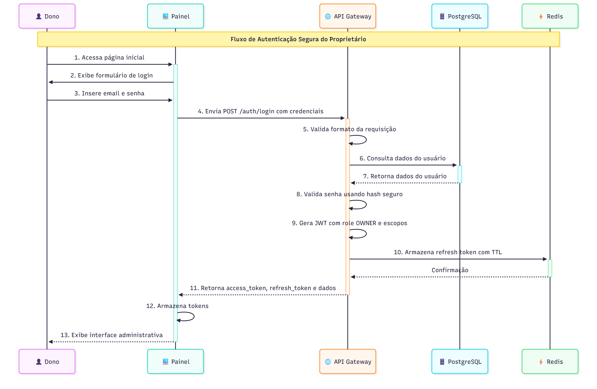
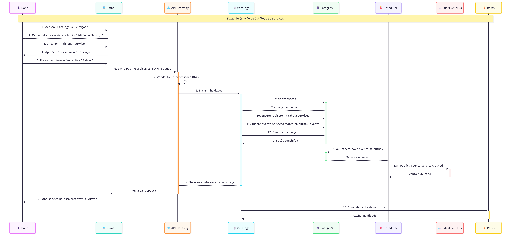
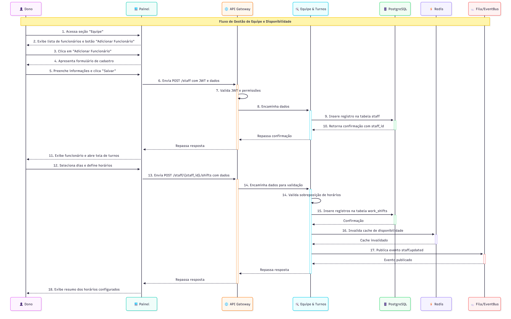
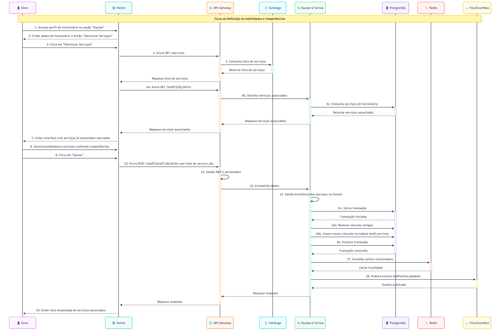
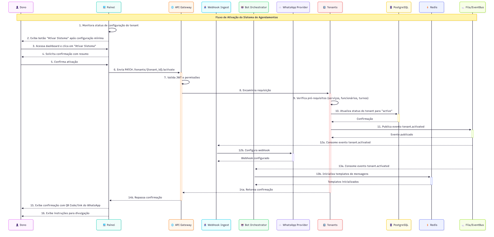
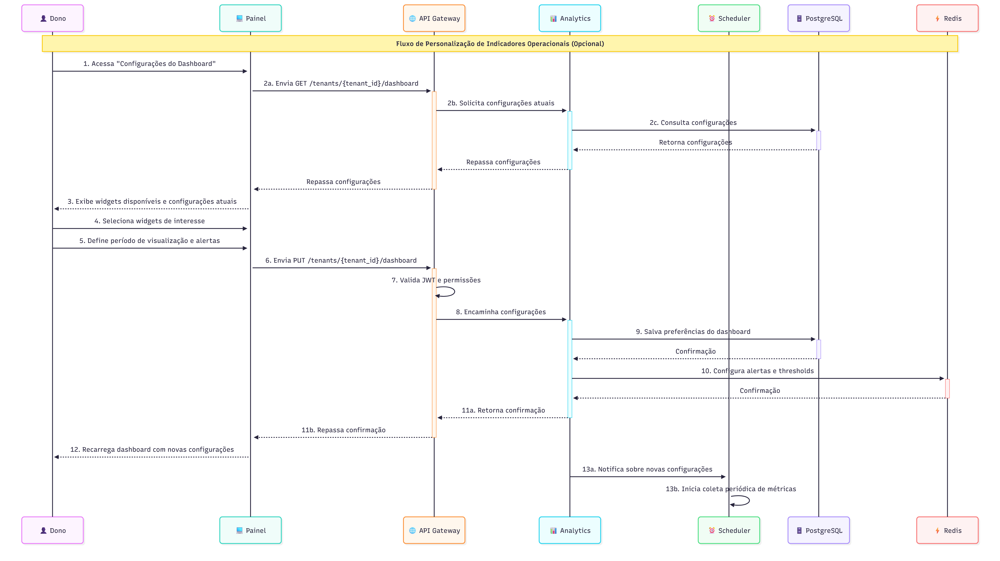
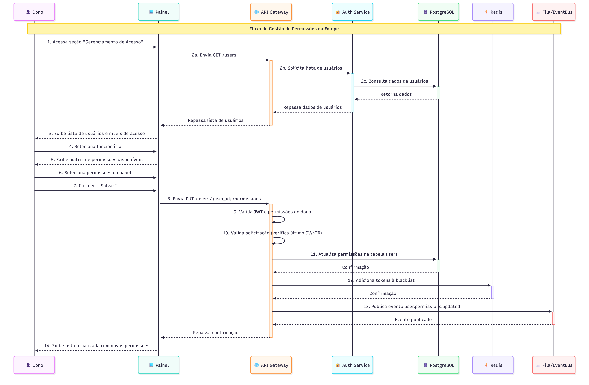
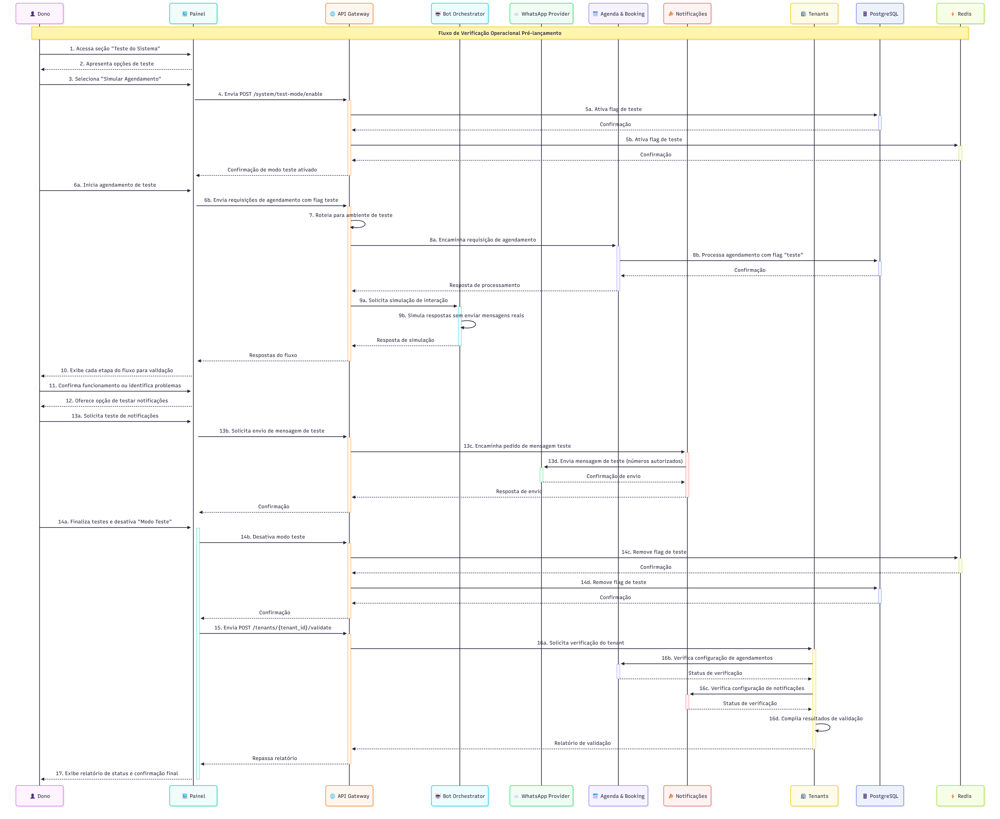

# Fluxos de Configuração Inicial

Estes fluxos descrevem o processo de setup inicial da plataforma pelo dono do estabelecimento. São executados uma única vez durante a ativação do sistema.

---

## 📑 Índice de Fluxos

### Fluxos Essenciais (MVP)
1. [Login do Dono na WebApp](#fluxo-1-login-do-dono-na-webapp) - Autenticação segura
2. [Cadastro de Serviços](#fluxo-2-cadastro-de-serviços) - Criação do catálogo
3. [Cadastro de Funcionários e Turnos](#fluxo-3-cadastro-de-funcionários-e-turnos) - Gestão de equipe
4. [Vinculação de Serviços aos Funcionários](#fluxo-4-vinculação-de-serviços-aos-funcionários) - Competências
5. [Finalização da Configuração](#fluxo-5-finalização-da-configuração) - Ativação do sistema

### Fluxos Opcionais
6. Configuração de Dashboard e Métricas
7. Configuração de Níveis de Acesso
8. Teste e Validação do Sistema

---

## Fluxos Essenciais (MVP)

### Fluxo 1 - Login do Dono na WebApp

> Persona: Dono do Estabelecimento  
> Canal: WebApp (Painel Administrativo)  
> Frequência: Setup inicial  
> Objetivo: Autenticação segura do proprietário 

#### Título: Autenticação Segura do Proprietário

#### História de Usuário
Como dono do estabelecimento, quero fazer login na plataforma de forma segura, para que eu possa acessar as funcionalidades administrativas do sistema e proteger meus dados empresariais.

#### Diagrama de Sequência

1. 👤 Dono acessa a página inicial da 💻 Painel
2. 💻 Painel exibe formulário de login
3. 👤 Dono insere email e senha
4. 💻 Painel envia requisição POST /auth/login para o 🌐 API Gateway com credenciais
5. 🌐 API Gateway valida formato da requisição e encaminha para serviço de autenticação
6. 🌐 API Gateway consulta 🗄️ PostgreSQL para validar credenciais
7. 🗄️ PostgreSQL retorna dados do usuário
8. 🌐 API Gateway valida senha usando hash seguro
9. 🌐 API Gateway gera JWT com role OWNER e escopos apropriados
10. 🌐 API Gateway armazena refresh token no ⚡ Redis com TTL
11. 🌐 API Gateway retorna access_token, refresh_token e dados básicos do usuário
12. 💻 Painel armazena tokens e redireciona para dashboard principal
13. 💻 Painel exibe interface administrativa com menus e recursos disponíveis

#### Critérios de Aceitação
- Deve permitir acesso apenas com credenciais válidas, rejeitando tentativas com senha incorreta
- Deve garantir que apenas usuários com role OWNER tenham acesso às funcionalidades administrativas
- Deve implementar proteção contra ataques de força bruta, limitando tentativas de login
- Deve garantir tokens JWT com expiração apropriada (15-30 minutos)
- Deve fornecer mecanismo de refresh token para renovação da sessão sem re-autenticação

#### Definition of Done:
- Interface de login responsiva e acessível implementada
- Sistema de autenticação testado com diferentes cenários (sucesso, falha, expiração)
- Logs de auditoria de tentativas de login configurados
- Documentação de API de autenticação concluída
- Testes de integração e unitários executados com sucesso
- Validação de segurança OWASP para autenticação realizada

---

### Fluxo 2 - Cadastro de Serviços

> Persona: Dono do Estabelecimento  
> Canal: WebApp  
> Frequência: Setup inicial  
> Objetivo: Criar catálogo de serviços  

#### Título:  Criação do Catálogo de Serviços

#### História de Usuário
Como dono do estabelecimento, quero cadastrar os serviços que ofereço com suas características (nome, preço, duração), para que os clientes possam conhecer minhas ofertas e agendar serviços específicos.

#### Diagrama de Sequência

1. 👤 Dono acessa seção "Catálogo de Serviços" no 💻 Painel
2. 💻 Painel exibe lista de serviços existentes (vazia inicialmente) e botão "Adicionar Serviço"
3. 👤 Dono clica em "Adicionar Serviço"
4. 💻 Painel apresenta formulário com campos: nome, descrição, preço, duração em minutos
5. 👤 Dono preenche informações do serviço e clica em "Salvar"
6. 💻 Painel envia requisição POST /services com JWT no header e dados do serviço
7. 🌐 API Gateway valida JWT e permissões (role OWNER)
8. 🌐 API Gateway encaminha dados para 🧾 Catálogo
9. 🧾 Catálogo inicia transação no 🗄️ PostgreSQL
10. 🧾 Catálogo insere registro na tabela services
11. 🧾 Catálogo insere evento service.created na tabela outbox_events
12. 🧾 Catálogo finaliza transação
13. ⏰ Scheduler detecta novo evento na outbox e publica na 📨 Fila/EventBus
14. 🧾 Catálogo retorna confirmação e service_id
15. 💻 Painel exibe serviço na lista de serviços com status "Ativo"
16. 🧾 Catálogo invalida cache de serviços no ⚡ Redis

#### Critérios de Aceitação
- Deve permitir cadastrar serviços com nome, descrição, preço e duração obrigatórios
- Deve garantir que cada serviço seja associado ao tenant_id correto do estabelecimento
- Deve validar formato e limites de dados (ex: preço positivo, duração > 0)
- Deve garantir persistência transacional entre dados do serviço e evento de criação
- Deve atualizar automaticamente o catálogo visível para clientes após criação

#### Definition of Done:
- Interface de cadastro e listagem de serviços implementada
- Validação de formulário client-side e server-side implementada
- Testes unitários de validação de regras de negócio concluídos
- Testes de integração da API de serviços realizados
- Invalidação de cache configurada e testada
- Documentação da API de serviços atualizada

---

### Fluxo 3 - Cadastro de Funcionários e Turnos

> Persona: Dono do Estabelecimento  
> Canal: WebApp  
> Frequência: Setup inicial  
> Objetivo: Gestão de equipe e disponibilidade  

#### Título: Gestão de Equipe e Disponibilidade

#### História de Usuário
Como dono do estabelecimento, quero cadastrar meus funcionários e definir seus turnos de trabalho, para que o sistema possa calcular corretamente a disponibilidade para agendamentos.

#### Diagrama de Sequência

1. 👤 Dono acessa seção "Equipe" no 💻 Painel
2. 💻 Painel exibe lista de funcionários existentes e botão "Adicionar Funcionário"
3. 👤 Dono clica em "Adicionar Funcionário"
4. 💻 Painel apresenta formulário com campos: nome, telefone, status (ativo/inativo)
5. 👤 Dono preenche informações básicas e clica em "Salvar"
6. 💻 Painel envia requisição POST /staff com JWT e dados do funcionário
7. 🌐 API Gateway valida JWT e permissões
8. 🌐 API Gateway encaminha dados para 🛠️ Equipe & Turnos
9. 🛠️ Equipe & Turnos insere registro na tabela staff do 🗄️ PostgreSQL
10. 🗄️ PostgreSQL retorna confirmação com staff_id
11. 💻 Painel exibe funcionário na lista e abre tela de configuração de turnos
12. 👤 Dono seleciona dias da semana e define horários (início/fim) para cada dia
13. 💻 Painel envia requisição POST `/staff/{staff_id}/shifts` com dados dos turnos
14. 🛠️ Equipe & Turnos valida sobreposição de horários
15. 🛠️ Equipe & Turnos insere registros na tabela work_shifts para cada turno
16. 🛠️ Equipe & Turnos invalida cache de disponibilidade no ⚡ Redis
17. 🛠️ Equipe & Turnos publica evento staff.updated na 📨 Fila/EventBus
18. 💻 Painel exibe resumo dos horários configurados

#### Critérios de Aceitação
- Deve permitir cadastrar múltiplos funcionários com nome e telefone
- Deve garantir a definição de turnos de trabalho para cada dia da semana
- Deve validar que os turnos não tenham sobreposição para o mesmo funcionário
- Deve permitir configuração de diferentes horários para diferentes dias
- Deve atualizar automaticamente o cálculo de disponibilidade após configuração

#### Definition of Done:
- Interface de cadastro de funcionários implementada
- Interface de configuração de turnos com seleção visual de horários implementada
- Validação de regras de negócio para turnos implementada
- Testes unitários e de integração concluídos
- Cache de disponibilidade configurado corretamente
- Documentação da API de equipe e turnos atualizada

---

### Fluxo 4 - Vinculação de Serviços aos Funcionários

> Persona: Dono do Estabelecimento  
> Canal: WebApp  
> Frequência: Setup inicial  
> Objetivo: Definir competências da equipe  

#### Título: Definição de Habilidades e Competências

#### História de Usuário
Como dono do estabelecimento, quero definir quais serviços cada funcionário está apto a realizar, para que o sistema ofereça apenas opções válidas durante o agendamento e distribua a carga de trabalho adequadamente.

#### Diagrama de Sequência

1. 👤 Dono acessa o perfil de um funcionário na seção "Equipe" do 💻 Painel
2. 💻 Painel exibe dados do funcionário e botão "Gerenciar Serviços"
3. 👤 Dono clica em "Gerenciar Serviços"
4. 💻 Painel envia requisição GET /services para 🌐 API Gateway
5. 🌐 API Gateway consulta 🧾 Catálogo para obter lista de serviços
6. 💻 Painel exibe interface com lista de serviços e checkboxes para seleção
7. 💻 Painel marca os serviços já associados ao funcionário (obtidos via `GET /staff/{id}/skills`)
8. 👤 Dono seleciona ou desmarca serviços conforme competências
9. 👤 Dono clica em "Salvar"
10. 💻 Painel envia requisição POST `/staff/{staff_id}/skills` com lista de service_ids
11. 🌐 API Gateway valida JWT e permissões
12. 🌐 API Gateway encaminha para 🛠️ Equipe & Turnos
13. 🛠️ Equipe & Turnos valida existência dos serviços selecionados no tenant
14. 🛠️ Equipe & Turnos inicia transação no 🗄️ PostgreSQL
15. 🛠️ Equipe & Turnos remove vínculos antigos e insere novos na tabela staff_services
16. 🛠️ Equipe & Turnos finaliza transação
17. 🛠️ Equipe & Turnos invalida caches relacionados no ⚡ Redis
18. 🛠️ Equipe & Turnos publica evento staff.skills.updated na 📨 Fila/EventBus
19. 💻 Painel exibe lista atualizada de serviços associados ao funcionário

#### Critérios de Aceitação
- Deve permitir selecionar múltiplos serviços para cada funcionário
- Deve garantir que apenas serviços existentes no tenant sejam vinculados
- Deve atualizar corretamente as associações quando serviços são removidos
- Deve refletir imediatamente as mudanças no cálculo de disponibilidade
- Deve garantir que o sistema nunca ofereça agendamentos com funcionários não capacitados

#### Definition of Done:
- Interface de gerenciamento de competências implementada
- Validação de consistência de dados implementada
- Atualização transacional da tabela de relacionamentos implementada
- Testes de validação e integridade referencial concluídos
- Invalidação de cache configurada e testada
- Documentação de API atualizada

---

### Fluxo 5 - Finalização da Configuração

> Persona: Dono do Estabelecimento  
> Canal: WebApp  
> Frequência: Uma vez (conclusão)  
> Objetivo: Ativar sistema de agendamentos  

#### Título: Ativação do Sistema de Agendamentos

#### História de Usuário
Como dono do estabelecimento, quero finalizar a configuração inicial e ativar o sistema, para que os clientes possam começar a agendar serviços através do WhatsApp.

#### Diagrama de Sequência

1. 💻 Painel monitora continuamente o status de configuração do tenant
2. Quando 👤 Dono completa configurações mínimas, 💻 Painel exibe botão "Ativar Sistema"
3. 👤 Dono acessa dashboard e clica em "Ativar Sistema"
4. 💻 Painel solicita confirmação com resumo das configurações
5. 👤 Dono confirma ativação
6. 💻 Painel envia requisição `PATCH /tenants/{tenant_id}/activate` para 🌐 API Gateway
7. 🌐 API Gateway valida JWT e permissões
8. 🌐 API Gateway encaminha requisição para serviço de gestão de tenants
9. Serviço verifica pré-requisitos (ao menos 1 serviço, 1 funcionário, turnos configurados)
10. Serviço atualiza status do tenant para "active" no 🗄️ PostgreSQL
11. Serviço publica evento tenant.activated na 📨 Fila/EventBus
12. 📥 Webhook Ingest configura webhook para o ☁️ WhatsApp Provider
13. 🤖 Bot Orchestrator inicializa templates de mensagens no ⚡ Redis
14. 🌐 API Gateway retorna confirmação de ativação
15. 💻 Painel exibe tela de confirmação com QR Code/link do WhatsApp
16. 👤 Dono recebe instruções de como divulgar o contato para clientes

#### Critérios de Aceitação
- Deve garantir que todos os pré-requisitos estão configurados antes da ativação
- Deve ativar corretamente a integração com WhatsApp Business API
- Deve disponibilizar imediatamente o bot para interações com clientes
- Deve permitir que o dono teste o fluxo de agendamento antes da divulgação
- Deve fornecer recursos para divulgação do serviço (QR Code, link direto)

#### Definition of Done:
 Verificação de configuração mínima implementada
- Interface de ativação e confirmação implementada
- Integração com WhatsApp Business API configurada e testada
- Fluxo de teste interno implementado
- Materiais de divulgação (QR Code, instruções) gerados automaticamente
- Documentação de ativação e troubleshooting concluída

---

## Fluxos Opcionais

### Fluxo 6 - Configuração de Dashboard e Métricas (Opcional)

> Persona: Dono do Estabelecimento
> Canal: WebApp
> Frequência: Pós-setup inicial
> Objetivo: Monitoramento de performance e indicadores

#### Título: Personalização de Indicadores Operacionais

#### História de Usuário:
Como dono do estabelecimento, quero configurar meu dashboard com métricas e indicadores relevantes para meu negócio, para que eu possa monitorar a performance e tomar decisões baseadas em dados.

#### Fluxo de Uso (Diagrama de Sequência):
1. 👤 Dono acessa a seção "Configurações do Dashboard" no 💻 Painel
2. 💻 Painel solicita configurações atuais via `` GET /tenants/{tenant_id}/dashboard``
3. 💻 Painel exibe widgets disponíveis e configurações atuais
4. 👤 Dono seleciona widgets de interesse (ocupação, taxa de conversão, cancelamentos)
5. 👤 Dono define período padrão de visualização e alertas desejados
6. 💻 Painel envia requisição ``PUT /tenants/{tenant_id}/dashboard`` para 🌐 API Gateway
7. 🌐 API Gateway valida JWT e permissões
8. 🌐 API Gateway encaminha para serviço de Analytics
9. Serviço salva preferências do dashboard no 🗄️ PostgreSQL
10. Serviço configura alertas solicitados e thresholds no ⚡ Redis
11. 🌐 API Gateway retorna confirmação
12. 💻 Painel recarrega dashboard com novas configurações
13. ⏰ Scheduler inicia coleta periódica de métricas conforme configuração

#### Critérios de Aceitação:
- Deve permitir seleção de widgets e métricas para o dashboard personalizado
- Deve garantir que as configurações sejam persistidas por tenant
- Deve oferecer opções de periodicidade (diário, semanal, mensal) para análises
- Deve permitir configuração de alertas para métricas críticas
- Deve calcular e exibir corretamente os dados conforme configuração

#### Definition of Done:
- Interface de configuração do dashboard implementada
- Biblioteca de widgets e visualizações implementada
- Persistência de preferências de usuário configurada
- Sistemas de alertas implementados
- Documentação de métricas disponíveis concluída
- Testes de cálculo e exibição de dados realizados

### Fluxo 7 - Configuração de Níveis de Acesso (Opcional)

> Persona: Dono do Estabelecimento
> Canal: WebApp
> Frequência: Pós-setup inicial
> Objetivo: Gestão de permissões da equipe

#### Título: Gestão de Permissões da Equipe

#### História de Usuário:
Como dono do estabelecimento, quero definir níveis de acesso para meus funcionários no sistema, para que cada um tenha acesso apenas às funcionalidades necessárias para seu papel, mantendo a segurança dos dados.

#### Fluxo de Uso (Diagrama de Sequência):
1. 👤 Dono acessa seção "Gerenciamento de Acesso" no 💻 Painel
2. 💻 Painel solicita lista de usuários via GET /users a 🌐 API Gateway
3. 💻 Painel exibe lista de usuários/funcionários e seus níveis de acesso atuais
4. 👤 Dono seleciona funcionário para configurar permissões
5. 💻 Painel exibe matriz de permissões disponíveis (OWNER, STAFF)
6. 👤 Dono seleciona permissões específicas ou papel pré-definido
7. 👤 Dono clica em "Salvar"
8. 💻 Painel envia requisição ``PUT /users/{user_id}/``permissions para 🌐 API Gateway
9. 🌐 API Gateway valida JWT e permissões do dono
10. 🌐 API Gateway valida solicitação (não pode remover último OWNER)
11. 🌐 API Gateway atualiza permissões na tabela users do 🗄️ PostgreSQL
12. 🌐 API Gateway adiciona tokens do usuário à blacklist no ⚡ Redis
13. 🌐 API Gateway publica evento user.permissions.updated na 📨 Fila/EventBus
14. 💻 Painel exibe lista atualizada com novas permissões

#### Critérios de Aceitação:
- Deve permitir definir permissões granulares ou papéis pré-definidos (OWNER, STAFF)
- Deve garantir que sempre exista pelo menos um usuário com papel OWNER
- Deve revogar tokens ativos quando permissões são alteradas
- Deve registrar alterações de permissões no audit_log
- Deve atualizar imediatamente o acesso após alterações

#### Definition of Done:
- Interface de gerenciamento de permissões implementada
- Regras de validação e segurança implementadas
- Revogação de tokens configurada
- Auditoria de mudanças de permissões implementada
- Testes de segurança e autorização realizados
- Documentação de papéis e permissões concluída

### Fluxo 8 - Teste e Validação do Sistema (Opcional)

> Persona: Dono do Estabelecimento
> Canal: WebApp
> Frequência: Pós-setup inicial
> Objetivo: Verificação operacional pré-lançamento

#### Título: Verificação Operacional Pré-lançamento

#### História de Usuário:
Como dono do estabelecimento, quero testar e validar todas as configurações antes do lançamento, para garantir que o sistema funcione corretamente e evitar problemas quando clientes reais começarem a utilizá-lo.

#### Fluxo de Uso (Diagrama de Sequência):
1. 👤 Dono acessa seção "Teste do Sistema" no 💻 Painel
2. 💻 Painel apresenta opções de teste (Agendamento, Notificações, Fluxo completo)
3. 👤 Dono seleciona "Simular Agendamento"
4. 💻 Painel envia requisição POST /system/test-mode/enable para 🌐 API Gateway
5. 🌐 API Gateway ativa flag de teste no 🗄️ PostgreSQL e ⚡ Redis
6. 👤 Dono realiza um agendamento de teste completo via interface simulada
7. 🌐 API Gateway roteia requisições para ambientes de teste isolados
8. 📅 Agenda & Booking processa agendamento normalmente, mas marca como "teste"
9. 🤖 Bot Orchestrator simula respostas de WhatsApp sem enviar mensagens reais
10. 💻 Painel exibe cada etapa do fluxo e permite validação
11. 👤 Dono confirma funcionamento ou identifica problemas
12. 💻 Painel oferece opção de testar notificações
13. 👤 Dono testa recebimento de mensagens no próprio WhatsApp (apenas números autorizados)
14. 👤 Dono finaliza testes e desativa "Modo Teste"
15. 💻 Painel envia requisição ``POST /tenants/{tenant_id}/validate``
16. 🌐 API Gateway coordena verificações em todos os serviços do domínio
17. 💻 Painel exibe relatório de status de cada componente e confirmação final

#### Critérios de Aceitação:
- Deve permitir simulação de agendamento completo em ambiente isolado
- Deve testar envio de notificações apenas para números autorizados (dono/equipe)
- Deve validar automaticamente configurações críticas e identificar problemas
- Deve gerar relatório detalhado de teste com status de cada componente
- Deve fornecer recomendações de correção para problemas identificados

#### Definition of Done:
- Modo de teste implementado com isolamento de dados reais
- Interface de simulação de agendamento implementada
- Sistema de validação automática implementado
- Testes de notificações com sandbox configurados
- Geração de relatório de prontidão implementada
- Documentação de troubleshooting e FAQ concluída