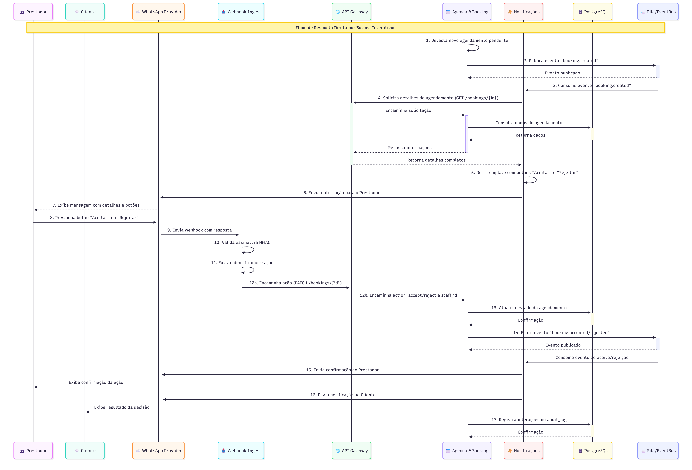
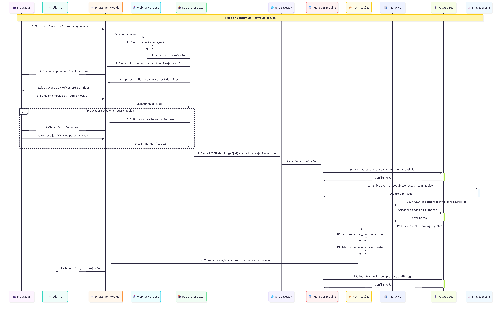
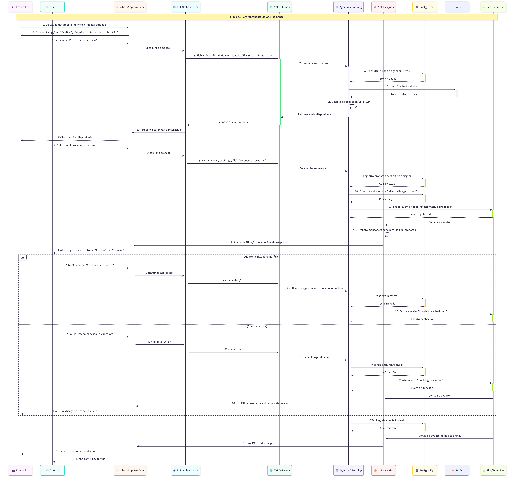
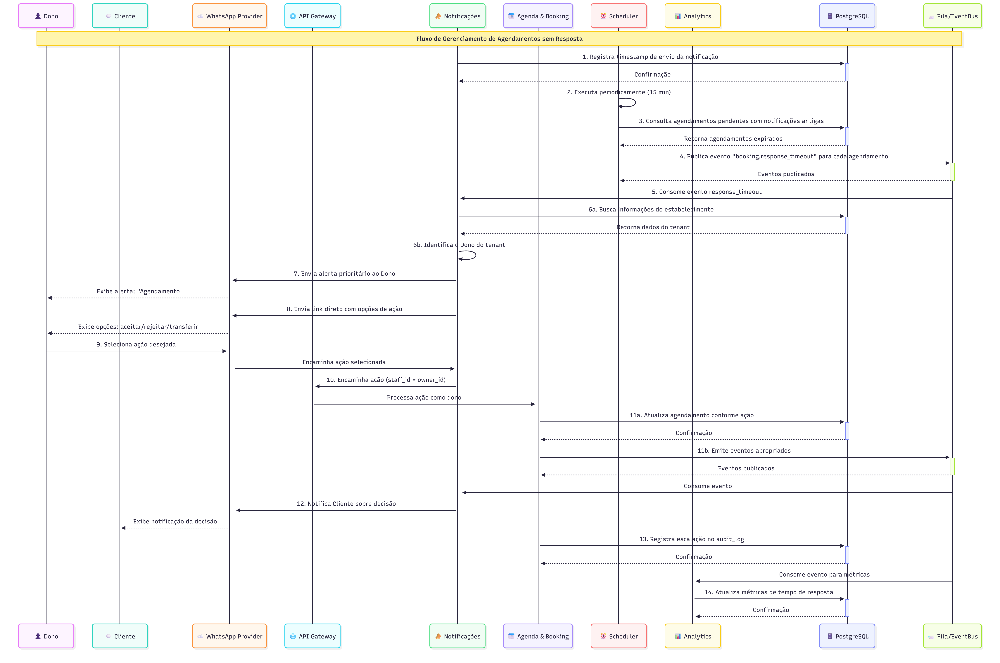
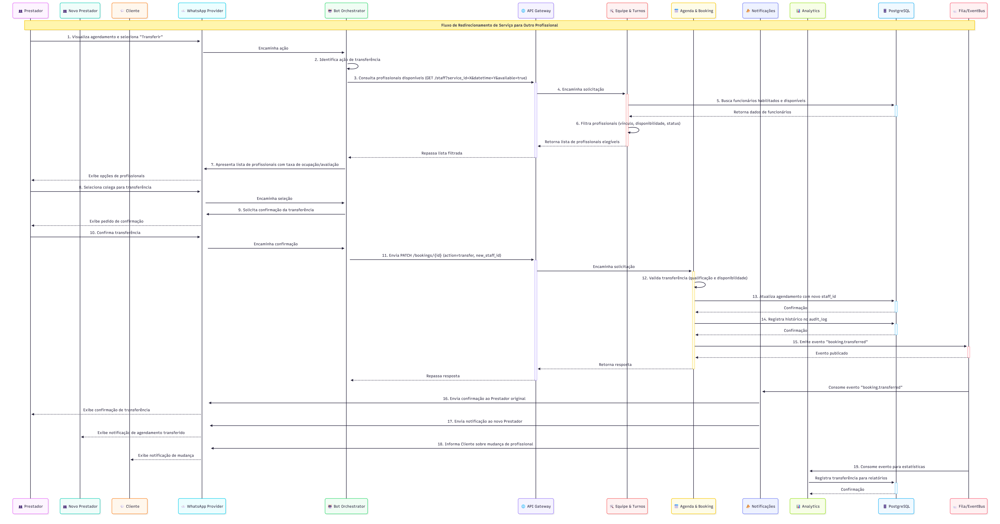
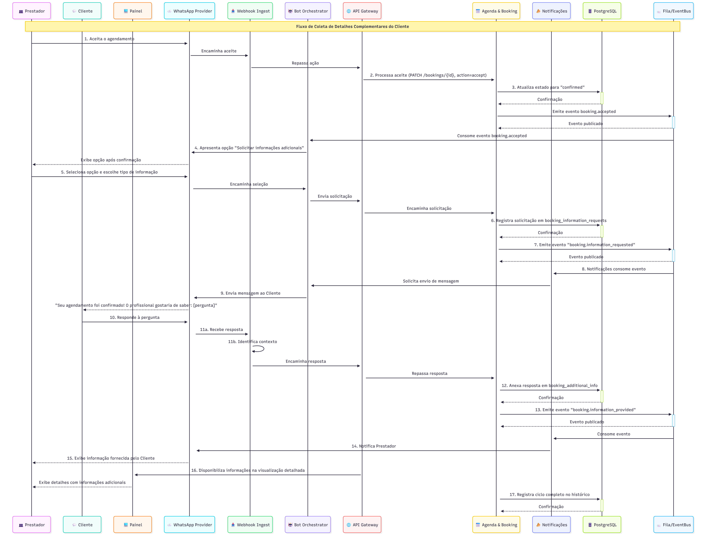
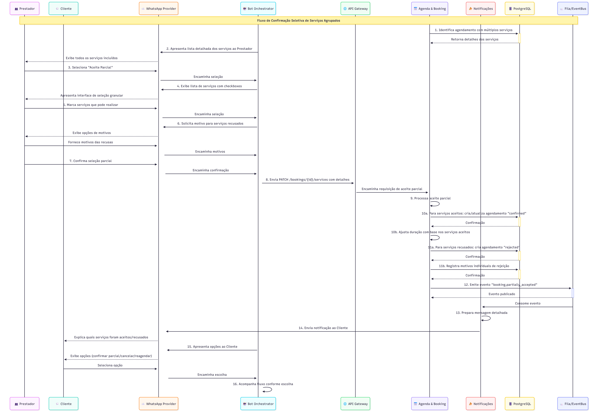
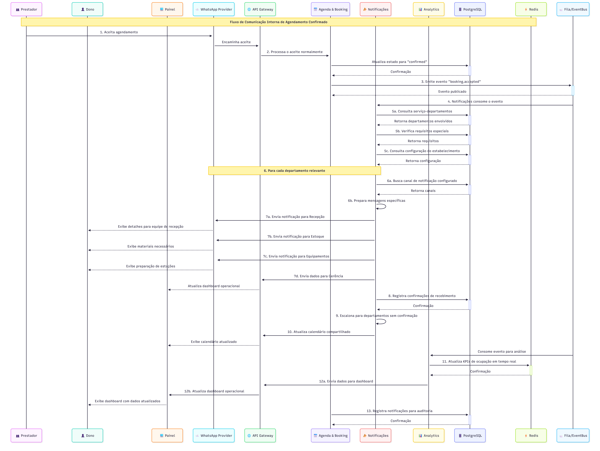

# Fluxos do Prestador

Estes fluxos descrevem as interações do prestador de serviços com o sistema de agendamentos.

---

## 📑 Índice de Fluxos

### Fluxos Essenciais (MVP)
1. [Reação Rápida via WhatsApp](#1-fluxo-de-reação-rápida-via-whatsapp) - Aceitar/rejeitar agendamento
2. [Justificativa para Rejeição](#2-fluxo-de-justificativa-para-rejeição) - Motivo de recusa para agendamento
3. [Proposta de Horário Alternativo](#3-fluxo-de-proposta-de-horário-alternativo) - Contraproposta de horário
4. [Expiração e Escalação](#4-fluxo-de-expiração-e-escalação) - Sem resposta
5. [Delegação/Transferência](#5-fluxo-de-delegaçãotransferência) - Transferir atendimento de um profissional para outro
6. [Informações Adicionais](#6-fluxo-de-informações-adicionais) - Solicitar detalhes complementares do cliente

### Fluxos Opcionais
7. [Aceite Parcial (múltiplos serviços)](#7-fluxo-de-aceite-parcial-para-múltiplos-serviços) - Selecionar serviços para aceitar
8. [Notificação ao Estabelecimento](#8-fluxo-de-notificação-ao-estabelecimento) - Alerta de novos agendamentos

---

## Fluxos Essenciais (MVP)

### 1. Fluxo de Reação Rápida via WhatsApp

> Persona: Prestador de Serviço  
> Canal: WhatsApp  
> Frequência: Ao receber solicitação  
> Objetivo: Responder rapidamente  

#### Título: Resposta Direta por Botões Interativos

#### História de Usuário
Como prestador de serviço, quero responder diretamente às solicitações de agendamento através de botões interativos no WhatsApp, para que eu possa gerenciar minha agenda rapidamente sem precisar acessar interfaces externas.

#### Fluxo de uso (Diagrama de Sequência)
1. 📅 Agenda & Booking detecta novo agendamento pendente (state = "pending")
2. 📅 Agenda & Booking publica evento ``booking.created`` na 📨 Fila/EventBus
3. 📣 Notificações consome o evento da 📨 Fila/EventBus
4. 📣 Notificações solicita ao 🌐 API Gateway detalhes completos do agendamento (``GET /bookings/{id}``)
5. 📣 Notificações gera template de mensagem com botões interativos "Aceitar" e "Rejeitar"
6. 📣 Notificações envia notificação via ☁️ WhatsApp Provider para o telefone do 👥 Prestador
7. 👥 Prestador recebe mensagem com detalhes do agendamento e botões de ação
8. 👥 Prestador pressiona botão "Aceitar" ou "Rejeitar" diretamente no WhatsApp
9. ☁️ WhatsApp Provider envia webhook com a resposta para o 📥 Webhook Ingest
10. 📥 Webhook Ingest valida assinatura HMAC e processa a resposta
11. 📥 Webhook Ingest extrai identificador do agendamento e ação selecionada
12. 🌐 API Gateway envia ``PATCH /bookings/{id}`` com action=accept/reject e staff_id
13. 📅 Agenda & Booking atualiza estado do agendamento no 🗄️ PostgreSQL
14. 📅 Agenda & Booking emite evento ``booking.accepted`` ou ``booking.rejected`` na 📨 Fila/EventBus
15. 📣 Notificações envia confirmação ao 👥 Prestador: "Agendamento [aceito/rejeitado] com sucesso"
16. 📣 Notificações envia notificação ao 💬 Cliente sobre a decisão do prestador
17. 📅 Agenda & Booking registra todas as interações no audit_log no 🗄️ PostgreSQL para rastreabilidade

#### Critérios de Aceitação
- Deve permitir aceite ou rejeição do agendamento com apenas um clique no WhatsApp
- Deve garantir que apenas o prestador designado possa responder à notificação
- Deve processar respostas em tempo real (latência máxima de 3 segundos)
- Deve fornecer confirmação visual da ação realizada ao prestador
- Deve registrar metadados completos da interação (timestamp, dispositivo, ação)

#### Definition of Done
- Implementação de templates de mensagem com botões interativos do WhatsApp
- Processamento de webhooks de resposta configurado e testado
- Validação de segurança para confirmar identidade do respondente
- Testes de concorrência para múltiplas respostas simultâneas
- Logs de auditoria implementados para todas as ações
- Monitoramento de taxa de resposta e tempo médio de resposta
- Documentação técnica dos templates e fluxo de resposta

---

### 2. Fluxo de Justificativa para Rejeição

> Persona: Prestador de Serviço  
> Canal: WhatsApp  
> Frequência: Ao rejeitar agendamento  
> Objetivo: Informar motivo  

#### Título: Captura de Motivo de Recusa

#### História de Usuário
Como prestador de serviço, quero informar o motivo da rejeição de um agendamento, para que o cliente compreenda a razão e o estabelecimento possa analisar padrões de recusa para melhorias.

#### Fluxo de uso (Diagrama de Sequência)
1. 👥 Prestador seleciona "Rejeitar" para um agendamento (via botão ou link)
2. 📥 Webhook Ingest identifica ação de rejeição
3. Em vez de processar imediatamente, 🤖 Bot Orchestrator envia nova mensagem via ☁️ WhatsApp Provider: "Por qual motivo você está rejeitando este agendamento?"
4. 🤖 Bot Orchestrator apresenta lista de motivos pré-definidos como botões de resposta rápida:
   - "Horário já ocupado"
   - "Serviço indisponível"
   - "Materiais em falta"
   - "Problemas técnicos"
   - "Outro motivo (especificar)"
5. 👥 Prestador seleciona um motivo pré-definido ou "Outro motivo"
6. Se "Outro motivo", 🤖 Bot Orchestrator solicita descrição em texto livre
7. 👥 Prestador fornece justificativa personalizada
8. 🌐 API Gateway envia ``PATCH /bookings/{id}`` com action=reject, staff_id e rejection_reason
9. 📅 Agenda & Booking atualiza estado do agendamento e registra motivo da rejeição no 🗄️ PostgreSQL
10. 📅 Agenda & Booking emite evento ``booking.rejected`` com o motivo incluído na 📨 Fila/EventBus
11. Analytics Service captura motivo para relatórios de gestão
12. 📣 Notificações prepara mensagem para o cliente incluindo motivo apropriado
13. 📣 Notificações adapta a mensagem para o cliente (reformulando motivos sensíveis)
14. 💬 Cliente recebe notificação de rejeição com justificativa e sugestões de alternativas via ☁️ WhatsApp Provider
15. 📅 Agenda & Booking registra motivo completo no audit_log no 🗄️ PostgreSQL para análise interna

#### Critérios de Aceitação
- Deve capturar motivo da rejeição em todas as recusas de agendamento
- Deve oferecer lista de motivos comuns pré-definidos e opção para justificativa personalizada
- Deve garantir que a comunicação ao cliente seja profissional e construtiva
- Deve armazenar motivos de rejeição para análise e relatórios gerenciais
- Deve permitir configuração dos motivos pré-definidos pelo estabelecimento

#### Definition of Done
- Interface para seleção de motivos de rejeição implementada
- Extensão do schema de agendamentos para incluir motivos de rejeição
- Mecanismo de adaptação de mensagens para comunicação ao cliente
- Dashboard analítico de motivos de rejeição implementado
- Testes de validação de motivos e persistência
- Documentação de APIs de rejeição atualizadas
- Guia para configuração de motivos personalizados

---

### 3. Fluxo de Proposta de Horário Alternativo

> Persona: Prestador de Serviço  
> Canal: WhatsApp  
> Frequência: Ao propor alternativa  
> Objetivo: Manter cliente  

#### Título: Contraproposta de Agendamento

#### História de Usuário
Como prestador de serviço, quero oferecer um horário alternativo ao invés de simplesmente rejeitar um agendamento, para que eu mantenha o cliente e otimize minha agenda aproveitando horários disponíveis.

#### Fluxo de uso (Diagrama de Sequência)
1. 👥 Prestador visualiza detalhes do agendamento e identifica impossibilidade
2. ☁️ WhatsApp Provider apresenta opções: "Aceitar", "Rejeitar", "Propor outro horário" 
3. 👥 Prestador seleciona "Propor outro horário"
4. 🌐 API Gateway solicita disponibilidade do prestador ao 📅 Agenda & Booking (``GET /availability?staff_id=X&date=Y``)
5. 📅 Agenda & Booking calcula slots disponíveis nas próximas 72 horas
6. 🤖 Bot Orchestrator apresenta calendário interativo com horários disponíveis via ☁️ WhatsApp Provider
7. 👥 Prestador seleciona horário alternativo proposto
8. 🌐 API Gateway envia ``PATCH /bookings/{id}`` com action=propose_alternative, new_datetime, staff_id
9. 📅 Agenda & Booking registra proposta sem alterar o agendamento original no 🗄️ PostgreSQL
10. 📅 Agenda & Booking atualiza estado para "alternative_proposed"
11. 📅 Agenda & Booking emite evento ``booking.alternative_proposed`` na 📨 Fila/EventBus
12. 📣 Notificações prepara mensagem para o cliente com detalhes da proposta
13. 💬 Cliente recebe notificação com botões: "Aceitar novo horário" ou "Recusar e cancelar" via ☁️ WhatsApp Provider
14. Se 💬 Cliente aceita, 📅 Agenda & Booking atualiza o agendamento com o novo horário
15. 📅 Agenda & Booking emite evento ``booking.rescheduled`` para atualização de sistemas na 📨 Fila/EventBus
16. Se 💬 Cliente recusa, 📅 Agenda & Booking cancela o agendamento e 📣 Notificações avisa o prestador
17. Em ambos os casos, 📅 Agenda & Booking registra a decisão e 📣 Notificações avisa todas as partes

#### Critérios de Aceitação
- Deve permitir que o prestador visualize sua disponibilidade real antes de propor alternativa
- Deve garantir que o horário proposto esteja realmente disponível (com lock temporário)
- Deve possibilitar que o cliente aceite ou recuse a proposta com um clique
- Deve atualizar corretamente todos os sistemas envolvidos após decisão do cliente
- Deve limitar propostas a um período configurável (ex: próximas 72 horas)

#### Definition of Done
- Interface para seleção de horários alternativos implementada
- Fluxo de negociação cliente-prestador via mensageria configurado
- Estado transitório "alternative_proposed" implementado no sistema
- Mecanismo de lock temporário para horário proposto
- Testes de fluxo completo de contraproposta com aceitação e recusa
- Métricas de taxa de aceitação de contrapropostas
- Documentação do ciclo de vida completo de agendamento com contrapropostas

---

### 4. Fluxo de Expiração e Escalação

> Persona: Dono do Estabelecimento  
> Canal: WebApp / WhatsApp  
> Frequência: Sem resposta do prestador  
> Objetivo: Garantir resposta  

#### Título: Gerenciamento de Agendamentos sem Resposta

#### História de Usuário
Como dono do estabelecimento, quero ser notificado quando um prestador não responde a um agendamento dentro do prazo estipulado, para que eu possa intervir, garantir o atendimento ao cliente e manter a qualidade do serviço.

#### Fluxo de uso (Diagrama de Sequência)
1. 📣 Notificações registra timestamp de envio quando notificação é enviada ao prestador no 🗄️ PostgreSQL
2. ⏰ Scheduler executa periodicamente (a cada 15 minutos)
3. ⏰ Scheduler executa query no 🗄️ PostgreSQL buscando agendamentos pendentes com notificações antigas
4. Para cada agendamento expirado encontrado:
   a. ⏰ Scheduler publica evento ``booking.response_timeout`` com booking_id e staff_id na 📨 Fila/EventBus
5. 📣 Notificações consome evento e busca informações do estabelecimento
6. 📣 Notificações identifica o 👤 Dono do tenant (estabelecimento)
7. 📣 Notificações envia alerta prioritário ao 👤 Dono via ☁️ WhatsApp Provider:
   "Agendamento #123 aguarda resposta do profissional João há mais de 2h"
8. 📣 Notificações envia link direto para ação do dono com opções:
   a. "Aceitar em nome do profissional"
   b. "Rejeitar e propor alternativa"
   c. "Transferir para outro profissional"
9. 👤 Dono seleciona ação desejada
10. 🌐 API Gateway processa a ação selecionada como se fosse do dono (staff_id = owner_id)
11. 📅 Agenda & Booking atualiza agendamento conforme ação e emite eventos apropriados na 📨 Fila/EventBus
12. 📣 Notificações notifica 💬 Cliente sobre a decisão
13. 📅 Agenda & Booking registra escalação no audit_log no 🗄️ PostgreSQL para análise de desempenho
14. Analytics Service atualiza métricas de tempo de resposta do profissional

#### Critérios de Aceitação
- Deve detectar automaticamente agendamentos sem resposta após 2 horas do envio da notificação
- Deve escalar para o dono/gerente com informações completas para decisão rápida
- Deve permitir que o dono tome ações imediatas sem necessidade de acessar outros sistemas
- Deve registrar métricas de escalação por profissional para análise de desempenho
- Deve garantir que nenhum agendamento fique sem resposta por mais de 3 horas

#### Definition of Done
- Implementação do ⏰ Scheduler para detecção de timeouts
- Interface de alertas prioritários para donos/gerentes
- Mecanismo de ação imediata via link seguro
- Dashboards de métricas de tempo de resposta por profissional
- Testes automatizados de detecção e escalação
- Documentação do processo de escalação e SLAs
- Configuração de parâmetros de timeout personalizáveis por estabelecimento

---

### 5. Fluxo de Delegação/Transferência

> Persona: Prestador de Serviço  
> Canal: WhatsApp  
> Frequência: Quando necessário  
> Objetivo: Transferir atendimento  

#### Título: Redirecionamento de Serviço para Outro Profissional

#### História de Usuário
Como prestador de serviço, quero transferir um agendamento para outro profissional qualificado, para que o cliente possa ser atendido mesmo quando eu não puder realizar o serviço pessoalmente.

#### Fluxo de uso (Diagrama de Sequência)
1. 👥 Prestador visualiza detalhes do agendamento e seleciona "Transferir"
2. 🤖 Bot Orchestrator identifica ação de transferência
3. 🌐 API Gateway consulta lista de profissionais disponíveis:
   a. ``GET /staff?service_id=X&datetime=Y&available=true``
4. 🌐 API Gateway encaminha solicitação ao 🛠️ Equipe & Turnos
5. 🛠️ Equipe & Turnos busca funcionários habilitados para o serviço e disponíveis no horário no 🗄️ PostgreSQL
6. 🛠️ Equipe & Turnos filtra profissionais baseado em:
   a. Vínculo com o serviço na tabela staff_services
   b. Disponibilidade no horário (turnos e outros agendamentos)
   c. Status ativo do funcionário
7. 🤖 Bot Orchestrator apresenta lista de profissionais elegíveis com taxa de ocupação/avaliação via ☁️ WhatsApp Provider
8. 👥 Prestador seleciona colega para transferência
9. 🤖 Bot Orchestrator solicita confirmação da transferência
10. 👥 Prestador confirma a transferência
11. 🌐 API Gateway envia ``PATCH /bookings/{id}`` com action=transfer, new_staff_id
12. 📅 Agenda & Booking valida transferência (profissional qualificado e disponível)
13. 📅 Agenda & Booking atualiza agendamento com novo staff_id no 🗄️ PostgreSQL
14. 📅 Agenda & Booking registra histórico de transferência no audit_log
15. 📅 Agenda & Booking emite evento ``booking.transferred`` na 📨 Fila/EventBus
16. 📣 Notificações envia confirmação para o 👥 Prestador original via ☁️ WhatsApp Provider
17. 📣 Notificações envia notificação ao novo 👥 Prestador sobre agendamento transferido
18. 📣 Notificações informa ao 💬 Cliente sobre a mudança de profissional
19. Analytics Service registra a transferência para relatórios de balanceamento de carga

#### Critérios de Aceitação
- Deve exibir apenas profissionais realmente qualificados e disponíveis para o serviço
- Deve garantir que o novo profissional seja notificado imediatamente sobre o agendamento transferido
- Deve informar o cliente sobre a mudança de profissional com explicação adequada
- Deve manter histórico completo de transferências para análise de distribuição
- Deve validar em tempo real a disponibilidade antes de confirmar a transferência

#### Definition of Done
- Interface de seleção de profissionais para transferência implementada
- Algoritmo de filtro de elegibilidade implementado e testado
- Modelo de dados estendido para registro de histórico de transferências
- Testes de cenários de transferência (sucesso, falha, indisponibilidade)
- Métricas de balanceamento de carga entre profissionais
- Templates de notificação para todas as partes envolvidas
- Documentação do processo de transferência e regras de negócio

---

### 6. Fluxo de Informações Adicionais

> Persona: Prestador de Serviço  
> Canal: WhatsApp  
> Frequência: Após aceitar agendamento  
> Objetivo: Coletar detalhes  

#### Título: Coleta de Detalhes Complementares do Cliente

#### História de Usuário
Como prestador de serviço, quero solicitar informações adicionais do cliente após aceitar um agendamento, para que eu possa me preparar adequadamente para o serviço e oferecer uma experiência personalizada.

#### Fluxo de uso (Diagrama de Sequência)
1. 👥 Prestador aceita o agendamento (via botão ou link)
2. 📅 Agenda & Booking processa o aceite normalmente (``PATCH /bookings/{id}`` com action=accept)
3. 📅 Agenda & Booking atualiza estado para "confirmed" no 🗄️ PostgreSQL
4. No momento do aceite, 🤖 Bot Orchestrator apresenta opção "Solicitar informações adicionais" via ☁️ WhatsApp Provider
5. 👥 Prestador seleciona essa opção e escolhe tipo de informação:
   a. Seleciona de template pré-definido (ex: "Histórico de procedimentos", "Alergias")
   b. Ou escreve pergunta personalizada
6. 📅 Agenda & Booking registra solicitação na tabela booking_information_requests no 🗄️ PostgreSQL
7. 📅 Agenda & Booking emite evento ``booking.information_requested`` na 📨 Fila/EventBus
8. 📣 Notificações consome o evento da 📨 Fila/EventBus
9. 🤖 Bot Orchestrator envia mensagem ao 💬 Cliente via ☁️ WhatsApp Provider:
   "Seu agendamento foi confirmado! O profissional gostaria de saber: [pergunta]"
10. 💬 Cliente responde à pergunta via WhatsApp
11. 📥 Webhook Ingest recebe resposta e identifica contexto
12. 📅 Agenda & Booking anexa resposta ao agendamento (tabela booking_additional_info) no 🗄️ PostgreSQL
13. 📅 Agenda & Booking emite evento ``booking.information_provided`` na 📨 Fila/EventBus
14. 📣 Notificações notifica 👥 Prestador sobre resposta recebida
15. 👥 Prestador recebe notificação com a informação fornecida pelo 💬 Cliente
16. 💻 Painel disponibiliza informações adicionais na visualização detalhada do agendamento
17. 📅 Agenda & Booking registra ciclo completo de solicitação-resposta no histórico do agendamento no 🗄️ PostgreSQL

#### Critérios de Aceitação
- Deve permitir solicitação de informações através de templates ou perguntas livres
- Deve vincular corretamente perguntas e respostas ao agendamento específico
- Deve notificar o prestador imediatamente quando o cliente fornecer as informações
- Deve exibir claramente as informações adicionais na interface de detalhes do agendamento
- Deve respeitar limitações de privacidade e não solicitar informações sensíveis não pertinentes

#### Definition of Done
- Extensão do modelo de dados para suportar solicitações e respostas
- Templates pré-definidos de perguntas comuns configuráveis
- Interface para solicitação de informações implementada
- Mecanismo de captura e processamento de respostas do cliente
- Testes de fluxo completo de solicitação e resposta
- Validação de segurança e privacidade de dados
- Documentação dos templates disponíveis e boas práticas

---

## Fluxos Opcionais

### 7. Fluxo de Aceite Parcial (para múltiplos serviços)

> Persona: Prestador de Serviço
> Canal: WhatsApp
> Frequência: Ao receber múltiplos serviços
> Objetivo: Aceitar parcialmente

#### Título: Confirmação Seletiva de Serviços Agrupados

#### História de Usuário:
Como prestador de serviço, quero aceitar apenas alguns dos serviços solicitados em um agendamento múltiplo, para que eu possa atender parcialmente o cliente quando não posso realizar todos os procedimentos solicitados.

#### Fluxo de uso (Diagrama de Sequência):
1. 📅 Agenda & Booking identifica agendamento com múltiplos serviços (tabela booking_services) no 🗄️ PostgreSQL
2. 🤖 Bot Orchestrator, ao notificar o 👥 Prestador, apresenta lista detalhada de todos os serviços incluídos via ☁️ WhatsApp Provider
3. 👥 Prestador visualiza agendamento e seleciona "Aceite Parcial"
4. 🤖 Bot Orchestrator exibe lista de serviços com checkboxes para seleção individual
5. 👥 Prestador marca quais serviços pode realizar e quais não pode
6. Para cada serviço não aceito, 👥 Prestador seleciona motivo da recusa
7. 👥 Prestador confirma seleção parcial
8. 🌐 API Gateway envia ``PATCH /bookings/{id}/services`` com lista de serviços aceitos e recusados
9. 📅 Agenda & Booking processa aceite parcial:
   a. Se todos serviços recusados: rejeita agendamento completo
   b. Se alguns aceitos: divide o agendamento em dois registros relacionados no 🗄️ PostgreSQL
10. Para serviços aceitos:
    a. 📅 Agenda & Booking cria ou atualiza agendamento com estado "confirmed"
    b. 📅 Agenda & Booking ajusta duração com base nos serviços aceitos
11. Para serviços recusados:
    a. 📅 Agenda & Booking cria agendamento com estado "rejected" e referência ao original
    b. 📅 Agenda & Booking registra motivos individuais de rejeição
12. 📅 Agenda & Booking emite evento "booking.partially_accepted" na 📨 Fila/EventBus
13. 📣 Notificações prepara mensagem detalhada para o cliente
14. 💬 Cliente recebe notificação via ☁️ WhatsApp Provider explicando quais serviços foram aceitos e quais foram recusados
15. 💬 Cliente recebe opções para:
    a. Confirmar agendamento parcial
    b. Cancelar tudo
    c. Tentar reagendar serviços recusados
16. 🤖 Bot Orchestrator acompanha fluxo conforme escolha do cliente

#### Critérios de Aceitação:
- Deve permitir seleção granular de serviços individuais dentro de um agendamento múltiplo
- Deve processar corretamente a divisão do agendamento mantendo referências entre registros
- Deve garantir recálculo preciso de duração e valores após aceite parcial
- Deve comunicar claramente ao cliente quais serviços foram aceitos e recusados
- Deve oferecer alternativas claras para os serviços recusados

#### Definition of Done:
- Modelo de dados estendido para suportar agendamentos relacionados
- Interface para seleção granular de serviços implementada
- Lógica de divisão de agendamentos implementada e testada
- Algoritmo de recálculo de duração e valores configurado
- Templates de notificação para aceite parcial
- Testes de cenários variados de aceite parcial
- Documentação do fluxo de vida de agendamentos parcialmente aceitos

### 8. Fluxo de Notificação ao Estabelecimento

> Persona: Dono do Estabelecimento
> Canal: WebApp / WhatsApp
> Frequência: Ao receber novo agendamento
> Objetivo: Alerta de novos agendamentos

#### Título: Comunicação Interna de Agendamento Confirmado

#### História de Usuário
Como estabelecimento, quero que todos os departamentos relevantes sejam automaticamente notificados após a confirmação de um agendamento, para que possam se preparar adequadamente para receber o cliente e garantir um atendimento perfeito.

#### Fluxo de uso (Diagrama de Sequência)
1. 👥 Prestador aceita agendamento
2. 📅 Agenda & Booking processa o aceite normalmente
3. 📅 Agenda & Booking emite evento "booking.accepted" na 📨 Fila/EventBus
4. 📣 Notificações consome o evento da 📨 Fila/EventBus
5. 📣 Notificações identifica departamentos envolvidos com base em:
   a. Tipo de serviço (tabela service_departments) no 🗄️ PostgreSQL
   b. Requisitos especiais do serviço
   c. Configuração do estabelecimento
6. Para cada departamento relevante:
   a. 📣 Notificações busca canal de notificação configurado (Slack, WhatsApp, email)
   b. 📣 Notificações prepara mensagem específica com informações pertinentes ao departamento
7. 📣 Notificações envia notificações personalizadas:
   - Recepção: detalhes do cliente, horário e serviço
   - Estoque: materiais necessários para o serviço
   - Equipamentos: preparação de estações de trabalho
   - Gerência: adições ao dashboard operacional
8. 📣 Notificações registra confirmações de recebimento das notificações no 🗄️ PostgreSQL
9. Para departamentos críticos sem confirmação, 📣 Notificações escalona após timeout
10. 📣 Notificações atualiza calendário compartilhado visível para toda a equipe
11. Analytics Service atualiza KPIs de ocupação e disponibilidade em tempo real no ⚡ Redis
12. 💻 Painel atualiza dashboard operacional com agendamentos confirmados
13. 📅 Agenda & Booking registra todas as notificações internas para auditoria no 🗄️ PostgreSQL

#### Critérios de Aceitação
- Deve identificar corretamente todos os departamentos relevantes para cada tipo de serviço
- Deve enviar notificações personalizadas por departamento com apenas informações pertinentes
- Deve garantir confirmação de recebimento para notificações críticas
- Deve atualizar automaticamente sistemas de visualização compartilhados (calendários, dashboards)
- Deve permitir configuração flexível de canais de comunicação por departamento

#### Definition of Done
- Modelo de relacionamento entre serviços e departamentos implementado
- Múltiplos canais de notificação configurados (Slack, WhatsApp, Email, etc.)
- Templates específicos por departamento implementados
- Mecanismo de confirmação de recebimento configurado
- Integrações com sistemas de calendário e dashboard
- Testes de notificação para todos os departamentos
- Interface de configuração de canais de comunicação
- Documentação do fluxo de comunicação interna
