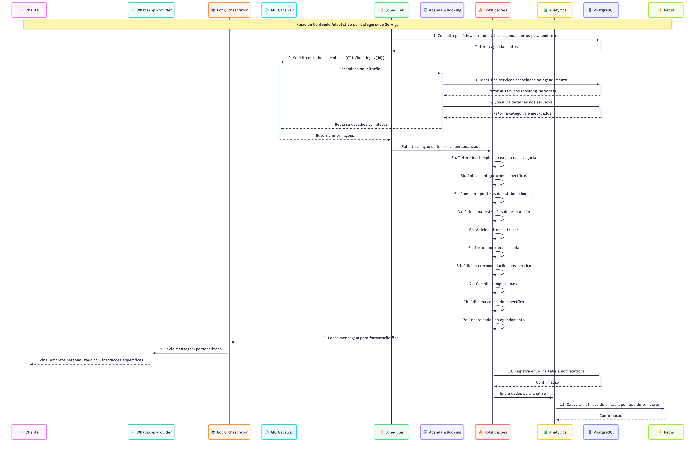
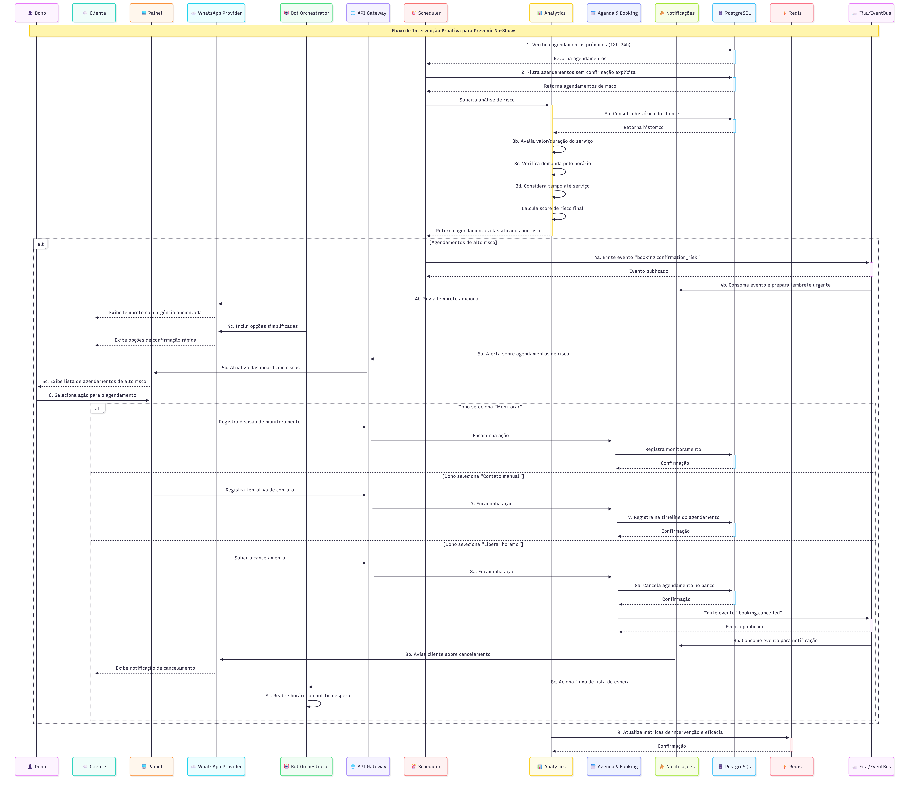
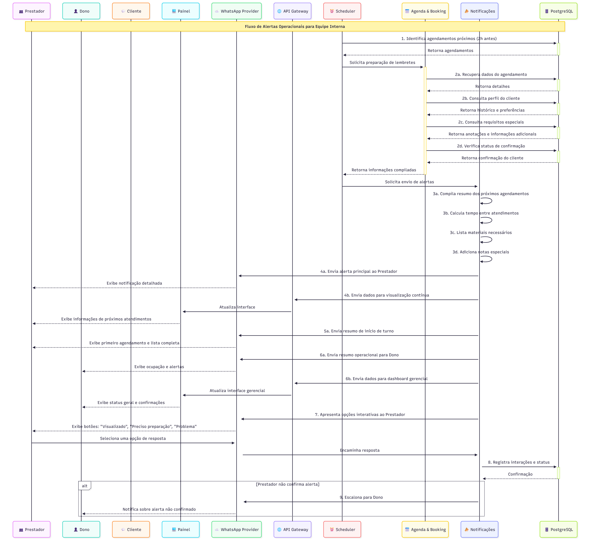
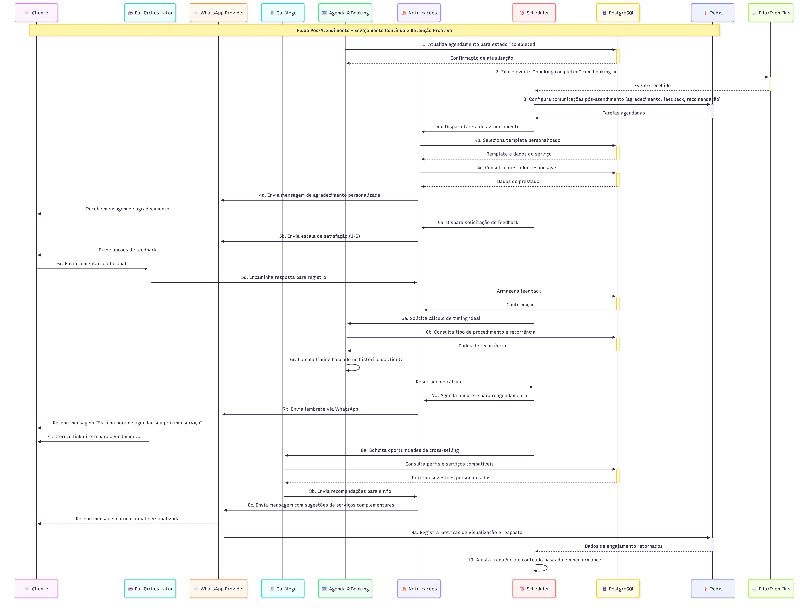
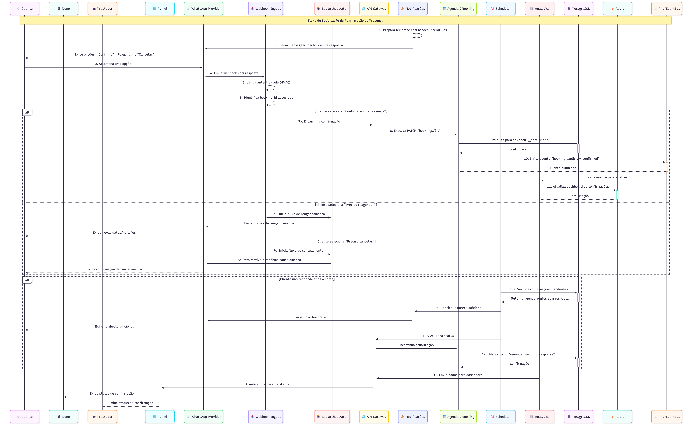
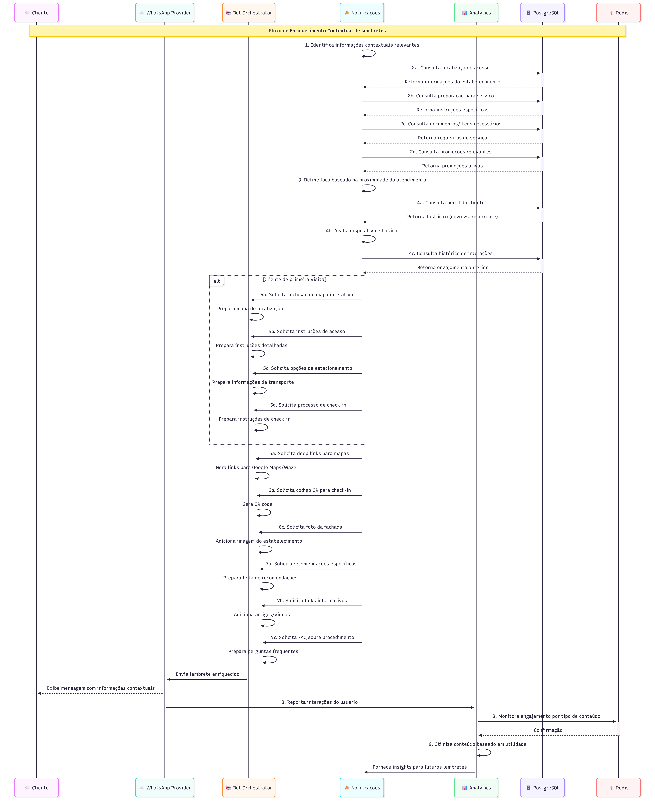

# Fluxos de Lembretes

Estes fluxos descrevem o sistema automatizado de lembretes e notificações para clientes, prestadores e estabelecimento.

---

## 📑 Índice de Fluxos

### Fluxos Essenciais (MVP)
1. [Personalização de Lembretes por Tipo de Serviço](#1-fluxo-de-personalização-de-lembretes-por-tipo-de-serviço) - Configurar lembretes
2. [Escalação para Agendamentos não Confirmados](#2-fluxo-de-escalação-para-agendamentos-não-confirmados) - Sem confirmação
3. [Lembretes para o Prestador/Estabelecimento](#3-fluxo-de-lembretes-para-o-prestadorestabelecimento) - Avisos internos
4. [Lembretes Pós-Atendimento](#4-fluxo-de-lembretes-pós-atendimento) - Feedback e retenção

### Fluxos Opcionais

5. [Confirmação Ativa pelo Cliente](#5-fluxo-de-confirmação-ativa-pelo-cliente-opcional) - Cliente confirma presença

6. [Comunicação de Informações Adicionais](#6-fluxo-de-comunicação-de-informações-adicionais-opcional) - Detalhes extras

---

## Fluxos Essenciais (MVP)

### 1. Fluxo de Personalização de Lembretes por Tipo de Serviço

> Persona: Dono do Estabelecimento  
> Canal: WebApp  
> Frequência: Configuração inicial  
> Objetivo: Customizar lembretes por serviço  

#### Título: Conteúdo Adaptativo por Categoria de Serviço



#### História de Usuário:
Como estabelecimento, quero que os lembretes enviados aos clientes sejam personalizados de acordo com o tipo de serviço agendado, para que o cliente receba instruções específicas relevantes para seu procedimento, aumentando a taxa de comparecimento e preparação adequada.

#### Fluxo de uso (Diagrama de Sequência):
1. ⏰ Scheduler executa consulta periódica no 🗄️ PostgreSQL para identificar agendamentos para lembrete
2. Para cada agendamento selecionado, ⏰ Scheduler solicita ao 🌐 API Gateway detalhes completos (``GET /bookings/{id}``)
3. 📅 Agenda & Booking identifica o(s) serviço(s) associado(s) ao agendamento na tabela booking_services no 🗄️ PostgreSQL
4. 📅 Agenda & Booking consulta tabela services no 🗄️ PostgreSQL para obter categoria e metadados do serviço
5. 📣 Notificações determina template apropriado baseado em:
   a. Categoria do serviço (ex: cabelo, unhas, estética facial)
   b. Configurações específicas de serviço (service_metadata)
   c. Políticas do estabelecimento (tenant_notification_settings)
6. 📣 Notificações seleciona conteúdo dinâmico a ser incluído:
   a. Instruções de preparação específicas (ex: "não lave o cabelo 24h antes")
   b. Itens a trazer (ex: "traga referências de imagens")
   c. Duração estimada do procedimento
   d. Recomendações pós-serviço
7. 📣 Notificações compila mensagem final combinando:
   a. Template base de lembrete (data, hora, estabelecimento)
   b. Conteúdo específico do serviço
   c. Dados do agendamento (profissional, sala)
8. 🤖 Bot Orchestrator gera mensagem final formatada para WhatsApp
9. ☁️ WhatsApp Provider envia mensagem personalizada ao 💬 Cliente
10. 📣 Notificações registra envio na tabela notifications com template_type usado no 🗄️ PostgreSQL
11. Analytics Service captura métricas de eficácia por tipo de template no ⚡ Redis

#### Critérios de Aceitação:
- Deve permitir configuração de templates específicos para cada categoria de serviço
- Deve garantir que instruções de preparação adequadas sejam incluídas para cada tipo de serviço
- Deve suportar conteúdo dinâmico baseado em atributos específicos do serviço
- Deve manter biblioteca de instruções pré e pós-atendimento por serviço
- Deve fornecer métricas de eficácia por tipo de template (taxa de confirmação, no-show)

#### Definition of Done:
- Estrutura de dados para categorização de serviços implementada
- Biblioteca de templates por categoria de serviço configurada
- Mecanismo de composição dinâmica de mensagens implementado
- Testes de renderização para diferentes tipos de serviço
- Validação de conteúdo com profissionais especialistas em cada área
- Dashboard para análise de eficácia por tipo de template/serviço
- Documentação técnica do sistema de templates e variáveis dinâmicas

---

### 2. Fluxo de Escalação para Agendamentos não Confirmados

> Persona: Dono do Estabelecimento  
> Canal: WebApp / WhatsApp  
> Frequência: Sem confirmação  
> Objetivo: Prevenir no-shows  

#### Título: Intervenção Proativa para Prevenir No-Shows 



#### História de Usuário
Como estabelecimento, quero um sistema que identifique e escalone agendamentos de risco (sem confirmação), para que eu possa intervir proativamente, reduzir no-shows e realocar recursos quando necessário.

#### Fluxo de uso (Diagrama de Sequência)
1. ⏰ Scheduler executa verificação de agendamentos próximos (12h-24h) no 🗄️ PostgreSQL
2. ⏰ Scheduler filtra agendamentos sem confirmação explícita:
   ```
   SELECT * FROM bookings 
   WHERE state = 'confirmed'
   AND confirmation_status != 'explicitly_confirmed' 
   AND data_hora_inicio BETWEEN NOW() AND NOW() + INTERVAL '24 hours'
   ORDER BY data_hora_inicio ASC
   ```
3. Analytics Service calcula score de risco para cada agendamento baseado em:
   a. Histórico do 💬 Cliente (taxa de no-show anterior)
   b. Valor/duração do serviço
   c. Demanda pelo horário (lista de espera)
   d. Tempo desde agendamento até data do serviço
4. Para agendamentos de alto risco:
   a. ⏰ Scheduler emite evento ``booking.confirmation_risk`` na 📨 Fila/EventBus
   b. 📣 Notificações consome o evento e envia lembrete adicional com urgência aumentada via ☁️ WhatsApp Provider
   c. 🤖 Bot Orchestrator inclui opções simplificadas para confirmação
5. 📣 Notificações alerta 👤 Dono e 💻 Painel exibe:
   a. Lista de agendamentos de alto risco agrupados
   b. Sugestão de intervenção (contato direto)
   c. Opção de liberar horário para lista de espera
6. 👤 Dono pode selecionar ação via 💻 Painel:
   a. "Monitorar" - mantém sob observação
   b. "Contato manual" - registra tentativa de contato
   c. "Liberar horário" - cancela e notifica lista de espera
7. Se "Contato manual", 📅 Agenda & Booking registra na timeline do agendamento no 🗄️ PostgreSQL
8. Se "Liberar horário", 📅 Agenda & Booking:
   a. Cancela agendamento com motivo "sem confirmação" no 🗄️ PostgreSQL
   b. 📣 Notificações avisa 💬 Cliente sobre cancelamento por falta de confirmação via ☁️ WhatsApp Provider
   c. 🤖 Bot Orchestrator aciona fluxo de lista de espera ou reabre horário
9. Analytics Service atualiza métricas de intervenção e eficácia no ⚡ Redis

#### Critérios de Aceitação
- Deve identificar automaticamente agendamentos de risco usando múltiplos critérios
- Deve permitir categorização de níveis de risco (baixo/médio/alto) com visualização clara
- Deve fornecer ferramentas de intervenção para o estabelecimento (contato direto, cancelamento)
- Deve registrar histórico de no-shows por cliente para refinar previsões futuras
- Deve medir eficácia de diferentes estratégias de intervenção

#### Definition of Done
- Algoritmo de cálculo de risco de no-show implementado
- Dashboard de risco com categorização visual implementado
- Interface de gerenciamento de intervenção desenvolvida
- Fluxo de cancelamento por falta de confirmação
- Sistema de notificação para estabelecimento configurado
- Testes de predição de no-show com dados históricos
- Documentação técnica de cálculo de risco e ações recomendadas
- Métricas de eficácia de intervenção implementadas

---

### 3. Fluxo de Lembretes para o Prestador/Estabelecimento

> Persona: Prestador / Dono  
> Canal: WhatsApp  
> Frequência: Antes dos agendamentos  
> Objetivo: Preparar equipe  

#### Título: Alertas Operacionais para Equipe Interna



#### História de Usuário
Como prestador de serviço, quero receber lembretes sobre meus próximos atendimentos com informações relevantes sobre o cliente e serviço, para que eu possa me preparar adequadamente e oferecer uma experiência personalizada.

#### Fluxo de uso (Diagrama de Sequência)
1. ⏰ Scheduler identifica agendamentos próximos (2h antes) para notificação aos 👥 Prestadores no 🗄️ PostgreSQL
2. Para cada agendamento, 📅 Agenda & Booking recupera informações relevantes:
   a. Dados do agendamento (horário, serviço, sala)
   b. Perfil do 💬 Cliente (histórico, preferências)
   c. Requisitos especiais (anotações prévias, informações adicionais)
   d. Status de confirmação do cliente
3. 📣 Notificações compila resumo operacional personalizado para o 👥 Prestador:
   a. Próximos agendamentos em sequência
   b. Tempo disponível entre atendimentos
   c. Materiais necessários por atendimento
   d. Notas especiais (primeiro atendimento, cliente VIP)
4. 📣 Notificações envia alerta ao 👥 Prestador via canal preferido:
   a. ☁️ WhatsApp Provider para notificações principais
   b. 💻 Painel para visualização contínua
   c. SMS para alertas críticos (mudanças)
5. 📣 Notificações envia também resumo de início de turno:
   a. Primeiro agendamento do dia (30min antes)
   b. Lista completa de atendimentos programados
   c. Horários livres disponíveis
6. Para o 👤 Dono/gerência, 📣 Notificações envia:
   a. Resumo de ocupação do dia
   b. Alertas de horários de alta demanda
   c. Status de confirmação dos clientes
7. 👥 Prestador recebe notificação com opções via ☁️ WhatsApp Provider:
   a. "Visualizado" - confirma ciência
   b. "Preciso de preparação" - solicita recursos
   c. "Tenho um problema" - alerta sobre impedimento
8. 📣 Notificações registra todas as interações e status de preparação no 🗄️ PostgreSQL
9. Para alertas não confirmados, 📣 Notificações escalona para 👤 Dono

#### Critérios de Aceitação
- Deve enviar resumos diários no início do turno e lembretes individuais antes de cada atendimento
- Deve personalizar conteúdo baseado no perfil do cliente e histórico de atendimentos
- Deve garantir que o prestador confirme ciência dos próximos atendimentos
- Deve alertar sobre requisitos especiais ou preparações necessárias com antecedência
- Deve permitir que o prestador sinalize problemas que possam impactar o atendimento

#### Definition of Done
- Templates de notificação para prestadores implementados
- Sistema de resumo de turno e programação diária
- Mecanismo de confirmação de ciência configurado
- Alertas de requisitos especiais e preparações
- Testes de diferentes cenários de notificação
- Dashboard operacional para visualização de agenda
- Fluxo de escalonamento para notificações críticas
- Documentação técnica dos tipos de alerta e ações esperadas

---

### 4. Fluxo de Lembretes Pós-Atendimento

> Persona: Cliente  
> Canal: WhatsApp  
> Frequência: Pós-atendimento  
> Objetivo: Feedback e retenção

#### Título: Engajamento Contínuo e Retenção Proativa



#### História de Usuário
Como estabelecimento, quero enviar comunicações automatizadas após o atendimento, para agradecer ao cliente, solicitar feedback, recomendar o próximo agendamento ideal e aumentar a taxa de retenção e recorrência.

#### Fluxo de uso (Diagrama de Sequência)
1. 📅 Agenda & Booking atualiza agendamento para estado "completed" após atendimento no 🗄️ PostgreSQL
2. 📅 Agenda & Booking emite evento "booking.completed" com booking_id na 📨 Fila/EventBus
3. ⏰ Scheduler configura série de comunicações pós-atendimento no ⚡ Redis:
   a. Agradecimento imediato (2-3 horas após)
   b. Solicitação de feedback (24 horas após)
   c. Recomendação de próximo serviço (baseado em serviço atual)
4. Para comunicação de agradecimento:
   a. 📣 Notificações seleciona template personalizado por serviço
   b. 📣 Notificações inclui dicas de cuidados pós-atendimento específicas
   c. 📣 Notificações menciona nome do 👥 Prestador que realizou o serviço
   d. 📣 Notificações envia mensagem via ☁️ WhatsApp Provider
5. Para solicitação de feedback:
   a. 📣 Notificações inclui escala de satisfação (1-5 estrelas) via ☁️ WhatsApp Provider
   b. 🤖 Bot Orchestrator oferece campo para comentários adicionais
   c. 📣 Notificações incentiva avaliação em plataformas externas (Google, etc)
6. 📅 Agenda & Booking calcula timing ideal para próximo serviço baseado em:
   a. Tipo de procedimento realizado (tabela service_recurrence) no 🗄️ PostgreSQL
   b. Histórico de agendamentos do cliente (frequência típica)
   c. Recomendações técnicas do prestador
7. Na data calculada para novo agendamento (ex: 30 dias para corte, 45 para coloração):
   a. 📣 Notificações envia lembrete via ☁️ WhatsApp Provider: "Está na hora de agendar seu próximo [serviço]"
   b. 🤖 Bot Orchestrator inclui link direto para agendamento facilitado
   c. 🤖 Bot Orchestrator sugere data/horário similar ao anterior
8. Para serviços sazonais ou complementares:
   a. 🧾 Catálogo identifica oportunidades cross-selling
   b. 📣 Notificações envia sugestões personalizadas baseadas no perfil via ☁️ WhatsApp Provider
9. Analytics Service mede eficácia de cada comunicação no ⚡ Redis:
   a. Taxa de visualização
   b. Taxa de resposta (feedback)
   c. Taxa de conversão (reagendamento)
10. ⏰ Scheduler ajusta frequência e conteúdo baseado em performance

#### Critérios de Aceitação
- Deve enviar agradecimento personalizado com dicas pós-atendimento específicas para o serviço
- Deve solicitar feedback de forma não-intrusiva com opções simples de resposta
- Deve calcular e sugerir timing ideal para próximo agendamento baseado no tipo de serviço
- Deve facilitar novo agendamento com mínimos cliques/interações
- Deve medir eficácia de cada comunicação para otimização contínua

#### Definition of Done
- Templates personalizados por tipo de serviço implementados
- Mecanismo de feedback com múltiplos níveis implementado
- Algoritmo de cálculo de timing ideal para reagendamento
- Links diretos para reagendamento facilitado
- Testes de fluxo completo pós-atendimento
- Dashboard de eficácia das comunicações pós-atendimento
- Documentação técnica dos parâmetros de recorrência por serviço
- Sistema de ajuste dinâmico baseado em performance

## Fluxos Opcionais

### 5. Fluxo de Confirmação Ativa pelo Cliente

> Persona: Cliente  
> Canal: WhatsApp  
> Frequência: Ao receber lembrete  
> Objetivo: Confirmar presença  

#### Título: Solicitação de Reafirmação de Presença



#### História de Usuário:
Como estabelecimento, quero que os clientes confirmem ativamente sua presença ao receberem lembretes, para que eu possa ter maior certeza do comparecimento e otimizar minha agenda, liberando horários com antecedência em caso de desistências.

#### Fluxo de uso (Diagrama de Sequência):
1. 📣 Notificações prepara lembrete com botões interativos de confirmação
2. 📣 Notificações envia via ☁️ WhatsApp Provider mensagem clara com botões de resposta rápida:
   a. "Confirmo minha presença"
   b. "Preciso reagendar"
   c. "Preciso cancelar"
3. 💬 Cliente recebe notificação e seleciona uma das opções
4. ☁️ WhatsApp Provider envia webhook com resposta para 📥 Webhook Ingest
5. 📥 Webhook Ingest valida autenticidade da mensagem (HMAC signature)
6. 📥 Webhook Ingest identifica o booking_id associado à resposta
7. Baseado na resposta do 💬 Cliente:
   a. Se "Confirmo": 📅 Agenda & Booking atualiza booking.confirmation_status para "explicitly_confirmed" no 🗄️ PostgreSQL
   b. Se "Reagendar": 🤖 Bot Orchestrator inicia fluxo de reagendamento
   c. Se "Cancelar": 🤖 Bot Orchestrator inicia fluxo de cancelamento
8. Para confirmação, 🌐 API Gateway executa ``PATCH /bookings/{id}`` com confirmation_status
9. 📅 Agenda & Booking atualiza registro no 🗄️ PostgreSQL
10. 📅 Agenda & Booking emite evento ``booking.explicitly_confirmed`` na 📨 Fila/EventBus
11. Analytics Service atualiza dashboard de confirmações com dados do ⚡ Redis
12. Se 💬 Cliente não responder após 4 horas:
    a. ⏰ Scheduler detecta e 📣 Notificações envia lembrete adicional solicitando confirmação
    b. 📅 Agenda & Booking marca agendamento como "reminder_sent_no_response" no 🗄️ PostgreSQL
13. 💻 Painel fornece visibilidade de status de confirmação no dashboard para 👤 Dono e 👥 Prestador

#### Critérios de Aceitação:
- Deve permitir resposta direta do cliente com um único clique
- Deve processar e registrar confirmações explícitas em tempo real
- Deve iniciar fluxos apropriados para solicitações de reagendamento ou cancelamento
- Deve distinguir entre agendamentos "implicitamente confirmados" (sem resposta) e "explicitamente confirmados"
- Deve permitir ao estabelecimento visualizar taxa de resposta e agendamentos sem confirmação

#### Definition of Done:
- Implementação de templates interativos com botões de ação
- Extensão do modelo de dados para suportar estados de confirmação
- Processamento de webhooks de resposta implementado
- Fluxos de desvio (reagendamento/cancelamento) configurados
- Testes de comportamento com diferentes respostas do usuário
- Dashboard de taxas de confirmação implementado
- Alerta para estabelecimento sobre agendamentos sem confirmação
- Documentação de estados de confirmação e comportamentos esperados

### 6. Fluxo de Comunicação de Informações Adicionais

> Persona: Cliente  
> Canal: WhatsApp  
> Frequência: Com lembretes  
> Objetivo: Informações contextuais  

#### Título: Enriquecimento Contextual de Lembretes



#### História de Usuário
Como cliente, quero receber informações úteis e contextuais junto com meus lembretes de agendamento, para que eu possa me planejar adequadamente e ter uma experiência sem contratempos ao chegar no estabelecimento.

#### Fluxo de uso (Diagrama de Sequência)
1. 📣 Notificações, ao preparar lembretes, identifica informações contextuais relevantes
2. 📣 Notificações consulta 🗄️ PostgreSQL para obter informações adicionais por contexto:
   a. Localização e acesso (estabelecimento_info)
   b. Preparação para serviço (service_instructions)
   c. Documentos/itens necessários (service_requirements)
   d. Promoções relevantes (active_promotions)
3. Com base na proximidade do atendimento:
   a. 48h-72h antes: foco em preparação para o serviço
   b. 24h antes: foco em itens necessários e confirmação
   c. 2h-3h antes: foco em localização, estacionamento, check-in
4. 📣 Notificações seleciona dinamicamente informações com base em:
   a. Perfil do 💬 Cliente (novo vs. recorrente)
   b. Dispositivo e horário de envio
   c. Histórico de interação com informações anteriores
5. Para clientes de primeira visita, 🤖 Bot Orchestrator:
   a. Inclui mapa de localização interativo
   b. Instruções de acesso detalhadas
   c. Opções de estacionamento ou transporte
   d. Processo de check-in
6. Para informações de localização, 🤖 Bot Orchestrator:
   a. Gera deep link para Google Maps/Waze
   b. Inclui código QR para check-in rápido
   c. Adiciona foto da fachada do estabelecimento
7. Para preparação de serviço, 🤖 Bot Orchestrator:
   a. Lista de recomendações específicas
   b. Links para artigos/vídeos informativos
   c. Perguntas frequentes sobre o procedimento
8. Analytics Service monitora engajamento com cada tipo de informação no ⚡ Redis
9. Analytics Service otimiza conteúdo com base em utilidade percebida

#### Critérios de Aceitação
- Deve fornecer informações contextuais diferentes baseadas no momento do lembrete
- Deve adaptar conteúdo para clientes novos vs. recorrentes
- Deve incluir elementos visuais úteis (mapas, QR codes) quando relevante
- Deve monitorar engajamento com diferentes tipos de informação para otimização
- Deve manter as informações adicionais atualizadas e precisas

#### Definition of Done
- Banco de dados de informações contextuais implementado
- Lógica de seleção de informações por contexto e timing
- Templates enriquecidos com elementos visuais e interativos
- Monitoramento de engajamento com diferentes tipos de conteúdo
- Testes de usabilidade com diferentes perfis de cliente
- Interface para gestão de informações contextuais
- Documentação técnica de tipos de enriquecimento disponíveis
